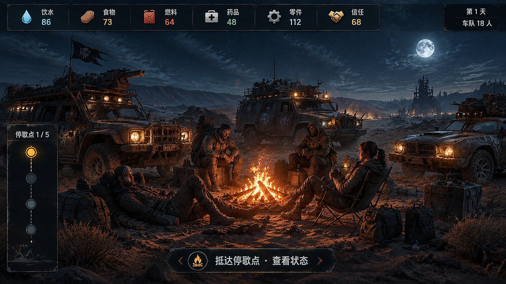
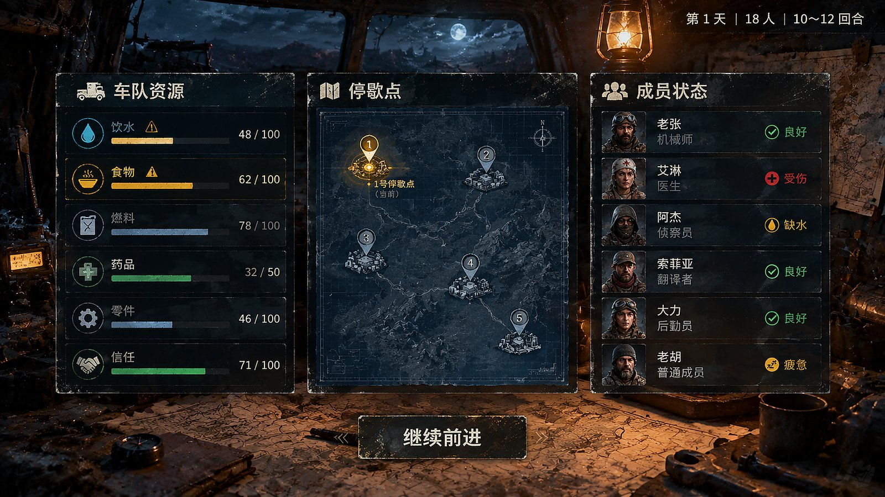
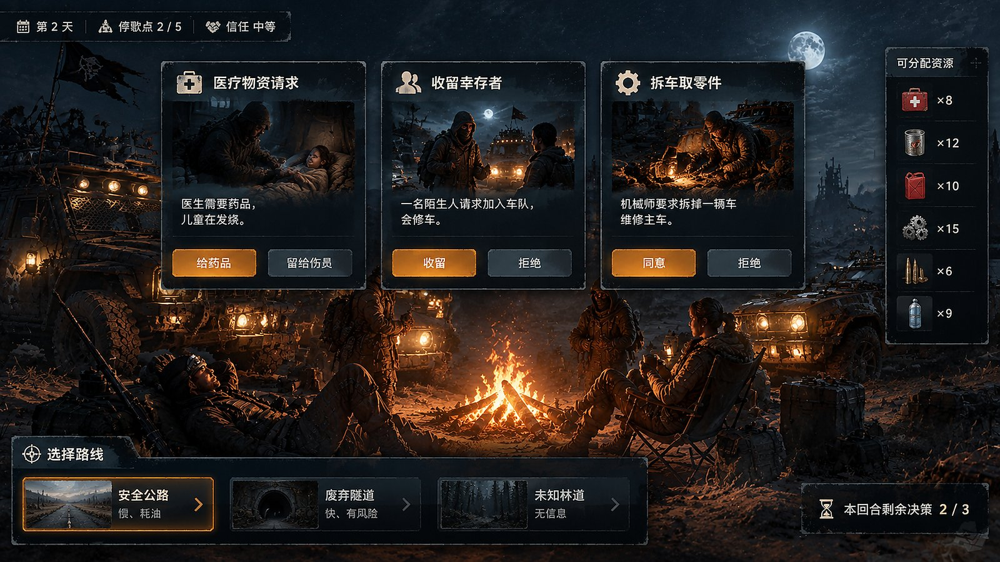
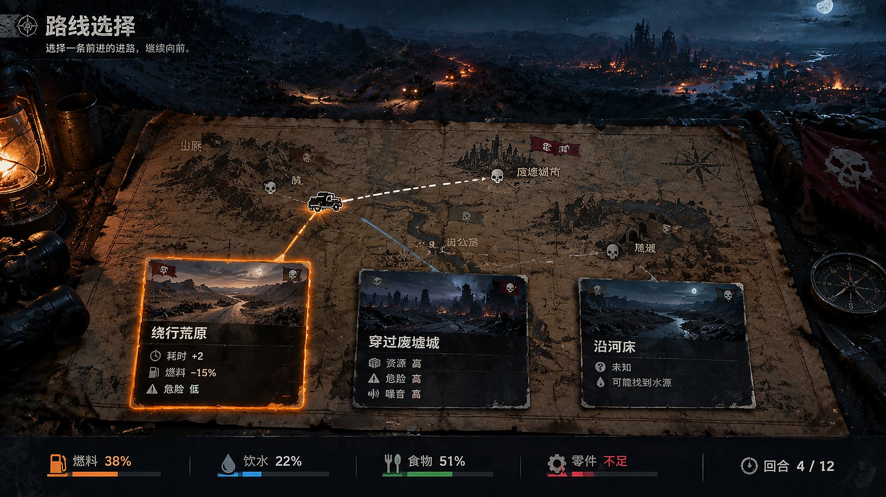
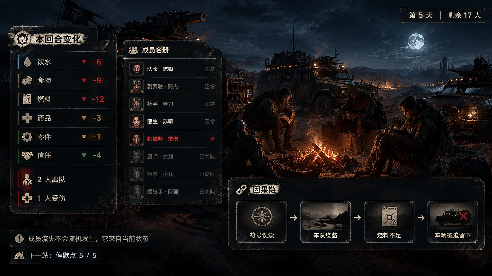
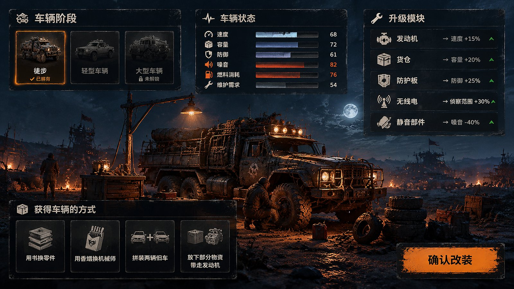

末日生存与车队经营项目

暂定版本

# 一、项目概述

**暂定名称：**待定

游戏类型：单机末日生存经营与叙事决策游戏；核心玩法由资源管理、路线选择、车辆升级和事件决策组成。

**故事时间：**公元2100年

**核心体验：**带领幸存者车队穿越异变区，在资源短缺、车辆损耗和怪物袭击中维持人类生存。

# 二、世界背景

未来的人类过度开发能源，导致生态系统崩坏，大量动物、植物和微生物发生异变，形成攻击性极强的异变生物。

人类与异变生物长期对抗。为了消灭怪物，人类不受限制地使用核武器，最终引发全球性灾难。核污染没有消灭怪物，反而使它们变得更强，世界进入长期末日状态。

人类只能依靠堡垒城市、移动聚落和车队在废土中生存。

# 三、核心玩法

- 车队抵达停歇点。

- 玩家查看饮水、食物、燃料、药品、零件和人员状态。

- 处理成员请求、路线信息、资源分配和怪物事件。

- 选择路线并继续前进。

- 根据资源、人员、车辆和噪音状态产生新的结果。

- 通过维修、交易和探索获得车辆与升级部件。

### 核心界面示意

<figure>

<figcaption>
图 1 抵达停歇点：车队每回合从停歇点开始，玩家先看到整体状态
</figcaption>
</figure>

<figure>

<figcaption>
图 2 状态总览：饮水、食物、燃料、药品、零件、信任与人员状态同屏
</figcaption>
</figure>

<figure>

<figcaption>
图 3 请求与决策：成员请求、路线信息与资源分配处理界面
</figcaption>
</figure>

<figure>

<figcaption>
图 4 选择路线并继续前进：在手绘路线图上取舍
</figcaption>
</figure>

<figure>

<figcaption>
图 5 结算与后果：资源、人员、车辆与噪音状态交叉产生的因果链
</figcaption>
</figure>

图 6 获得车辆与升级部件：车辆阶段、六项状态与升级模块

7\. 进入下一回合：保存本回合产生的路线、关系、知识和怪物活动变化。

6\. 维修升级：使用零件和人员能力维修车辆，选择新的升级模块，形成不同车队发展方向。

5\. 结果结算：根据人员关系、资源储备、车辆状态和玩家选择，产生伤亡、离队、资源变化或路线变化。

4\. 停歇决策：处理成员请求、侦察报告、交易机会和怪物事件。

3\. 行进消耗：车队自动前进，消耗饮水、食物和燃料，并受到天气、道路和噪音影响。

2\. 路线选择：在安全路线、资源路线和未知路线之间进行取舍。

1\. 出发准备：检查车队人口、资源、车辆状态和当前任务。

# 四、游戏玩法流程

本游戏以“天”为基本时间单位。一局通常在第 12～20 天之间达成结局；原型先验证 7～10 天。每天玩家处理 3～5 个主要交互，其中大部分是 NPC 对话；移动中的战斗、怪物群和道路事故属于即时突发，不计入对话选择次数。资源耗尽、车队分裂或满足结局条件时，可以在任意一天提前结束。

> 一局游戏主循环：开始初始化 → 早晨生成 NPC 当日事务 → 选择路线 → 车队持续移动 → 即时突发结算 → 抵达停歇点 → 处理 NPC 对话 → 执行一次营地行动 → 夜间涌现结算 → 检查死亡和结局 → 进入下一天。

## 4.1 每天的固定流程

| **阶段** | **玩家看到什么** | **玩家可以做什么** | **系统产生什么** |
|:--:|----|----|----|
| 1\. 早晨准备 | 资源、成员状态、车辆状态、昨日结果和当天 NPC 事务摘要。 | 查看事务优先级；执行一次准备行动，例如分配饮水、安排维修或公开情报。 | 为每个存活 NPC 生成当天目标、紧急度和截止时间。 |
| 2\. 路线选择 | 安全路线、资源路线和未知路线；未知路线只显示线索和风险等级。 | 选择当天路线，并确认是否采用绕行、低噪音或快速前进的预设行动。 | 锁定预计消耗、行进时间、噪音和可能出现的即时突发。 |
| 3\. 移动阶段 | 车队自动前进，界面显示路线进度、资源消耗和车辆噪音。 | 不能打开常规对话树重新规划；突发时只能执行预设行动或一个短促反应。 | 战斗、怪物群、道路坍塌、抛锚等直接结算人员、车辆、资源和路线变化。 |
| 4\. 停歇与对话 | 按紧急度排列的 NPC 对话队列。 | 回应、追问、承诺、拒绝、交换条件、让其他成员回答或暂缓处理。 | 改变信任、任务、路线意愿、资源、知识和下一天事务。 |
| 5\. 营地行动 | 阅读、教学、维修、交易、分配和休息等行动。 | 选择一次主要行动；行动消耗时间或资源。 | 知识传播、车辆修复、茶叶与香薰仪式、关系变化。 |
| 6\. 夜间结算 | 显示当天的因果链和状态变化。 | 查看结果，不再追加选择。 | 更新知识接受度、习惯、制度、隐藏事件进度和夜间资源消耗。 |

## 4.2 NPC 当日事务推动游戏

NPC 不是每天重复同一句请求。每天早晨，系统根据 NPC 的需求、职业、所属群体、个人记忆、前一天的对话结果、资源状态和历史事件，为每个存活 NPC 生成一个当日事务。事务是否进入对话队列，由紧急度和触发条件决定。

| **事务字段** | **含义** | **示例** |
|:--:|----|----|
| 需求 | NPC 当前最直接的生存或心理需求。 | 缺水、药品、尊重、路线信息、寻找亲人、学习维修。 |
| 目标 | NPC 今天想完成的事情。 | 请求优先分水、要求绕路、交换地图、让孩子学习技术。 |
| 对象 | 目标指向的人、群体、书籍或地点。 | 队长、另一群体、技术手册、某个停歇点。 |
| 紧急度 | 不处理会造成什么后果。 | 低：可以延期；中：信任下降；高：离队、冲突或危险事件。 |
| 截止时间 | 事务最晚处理的时机。 | 当天夜间、下一次停歇、指定天数后。 |
| 后果 | 玩家接受、拒绝或延期后的变化。 | 获得情报、消耗资源、改变路线、形成任务、提高分裂风险。 |

对话选择是本游戏的主要玩法。对话节点必须暂停自动行进，显示说话者、所属群体、需求、可用回应、需要消耗的资源和可能影响。玩家做出的回应要写入历史记录，并影响下一天的 NPC 事务。

| **当天对话结果** | **下一天可能出现的内容** |
|:--:|----|
| 接受路线请求 | NPC 成为路线向导；其他群体可能提出反对或要求补偿。 |
| 拒绝资源分配 | NPC 信任下降，可能私藏、离队或在下一次停歇发起冲突。 |
| 允许阅读和教学 | 下一天出现教学事务；知识接受度提高，可能形成新的职业。 |
| 交换地图或技术书 | 获得资源或路线，但失去原有知识；相关群体可能要求解释。 |
| 在突发事件中保护某个群体 | 被保护群体信任提高；未被保护群体可能提出新的政治请求。 |

## 4.2.1 初始成员与可招募成员

游戏开始时，玩家只有主角（队长）和四名基础成员，刚好满足车队运行所需的基础工作分配。初始成员的能力水平都处于基础范围。地图上还分布着未来可能加入车队的成员；他们没有独特技能，差异只体现在一项或多项数值上。玩家在路线和对话中的选择，可能救下、错过或导致这些成员死亡。

| **成员来源** | **当前规则** | **需要填写的参数** |
|:--:|----|----|
| 初始队伍 | 主角（队长）+ 4 名成员。 | 四名成员刚好覆盖车队运行所需的基础工作岗位；岗位名称、初始数值和姓名待填写。 |
| 初始数值 | 所有初始成员处于基础水平。 | 不设置成员专属技能；维修、医疗、侦察、后勤 / 沟通等岗位只由基础数值体现。 |
| 地图成员 | 分布在路线、停歇点、求救地点和特殊事件中。 | 玩家可能通过对话、救援、交易或路线选择救下，也可能因资源不足、错误选择或即时突发导致其死亡。 |
| 数值差异 | 可招募成员可能有一项或多项数值较高，也可能有明显短板。 | 例如维修效率较高但健康较低，或侦察数值较高但信任初始值较低；具体数值待填写。 |
| 招募结果 | 加入后增加人口和资源消耗，同时改变岗位效率、关系网络和 NPC 每日事务。 | 是否需要容量限制、招募条件和完整数值展示：待填写。 |

## 4.3 移动中的即时突发

移动阶段的突发情况不属于常规对话。它们不提前完整展示，也不给玩家重新打开资源界面进行长时间思考，直接根据当前状态和营地阶段留下的预设行动结算。

| **突发类型** | **触发条件** | **即时处理** | **结果** |
|:--:|----|----|----|
| 战斗 / 遭遇 | 路线危险、车辆防御低、噪音高或敌群已被吸引。 | 按预设行动防御、绕行、诱敌或保护伤员；允许时只显示一个短促反应按钮。 | 人员受伤、车辆损坏、燃料消耗、路线改变。 |
| 怪物群 | 夜间、噪音高、灯光强或尸体 / 气味未处理。 | 熄火、加速、绕行或承受袭击。 | 追踪值上升、路线阻塞或成员损失。 |
| 道路事故 | 道路标签与车辆类型不匹配，或车辆损坏达到阈值。 | 自动减速、抛锚、弃车或消耗零件。 | 当天行进中断，下一次停歇增加 NPC 事务。 |
| 短促求救信号 | 无线电模块、路线位置和历史线索满足条件。 | 只能决定是否立刻回应；详细谈判放入到达后的 NPC 对话。 | 获得线索或进入救援、交易、陷阱事件。 |

## 4.4 一天的实际示例

第 4 天早晨，机械师想学习技术手册，侦察员要求走旧公路，另一群体请求优先分配药品。玩家先选择旧公路。移动中因为车辆噪音高，怪物群直接出现；系统按照前一晚设定的“绕行”行动结算，车辆损失燃料但没有进入对话界面。抵达停歇点后，玩家先与侦察员对话，接受旧公路路线，随后拒绝药品优先分配，最后允许机械师教学。夜间结算后，机械师形成学徒事务，受拒绝的群体在下一天产生冲突事务，旧公路的路线知识被记录进车队档案。

## 4.5 程序实现边界

| **系统** | **必须实现** | **输入 / 输出** |
|:--:|----|----|
| NPC 日程系统 | 每天为存活 NPC 生成需求、目标、对象、紧急度、截止时间和后果；根据前一天结果调整权重。 | 输入：人物、群体、资源、历史；输出：当天对话队列。 |
| 对话系统 | 暂停行进，显示回应树；保存玩家选择和 NPC 事务状态。 | 输入：NPC 事务和条件；输出：资源、信任、任务、知识和下一天事务。 |
| 移动突发系统 | 在移动中筛选符合条件的突发，直接结算，不进入常规对话树。 | 输入：路线、车辆、噪音、时间、资源；输出：伤害、损坏、路线和事件日志。 |
| 涌现结算系统 | 夜间处理知识传播、习惯、制度、关系和隐藏事件进度。 | 输入：当天所有对话和突发记录；输出：下一天状态和因果链。 |
| 结局系统 | 每天夜间统一检查资源死亡、分裂、定居、文化遗产和特殊结局。 | 输入：全局状态；输出：继续下一天或锁定结局。 |

# 五、资源系统

# 六、书籍、茶叶与香薰系统

# 主题体现：涌现

本游戏不让玩家直接点击按钮获得“文明”或“共同语言”，而是让文明结果从局部行为中逐步出现。玩家只改变接触条件、资源分配和传播环境，最终形成的词汇、职业、货币、仪式和制度由人物关系、重复行为、信任、识字能力和资源稀缺共同决定。

书籍和茶叶与香薰分别代表文明涌现的两个时间尺度。茶叶与香薰解决“今天谁愿意坐下来合作”，书籍解决“这次合作如何被记住、传播并变成下一代的能力”。前者制造接触频率，后者沉淀共同记忆。

## 茶叶与香薰如何推动社会关系涌现

茶叶与香薰是低门槛的交换物和社交媒介。分享茶叶与香薰、交换茶叶与香薰和围绕篝火分享茶叶与香薰，会增加不同群体之间的接触次数；接触次数增加后，某些手势、词汇和交易方式会被反复模仿。长期下来，临时让步可能变成互助仪式，茶叶券或香薰券可能变成交换媒介，香薰垄断可能变成派系权力。

## 书籍如何推动知识和文明涌现

书籍是可以被理解、抄写、翻译、改写和遗失的记忆载体。技术手册被机械师读懂后，会提高修车成功率；当机械师把内容教给年轻人，知识就从个人能力变成职业；当职业被多人继承并写入笔记本，它又可能变成车队的教育制度和公共规则。

书籍被烧掉、交换或遗失时，对应的知识路径也可能断裂；茶叶与香薰短缺、垄断或仪式中断时，原本稳定的社交关系也可能瓦解。道具价值因此会随社会结构变化，而不是固定提供数值加成。

## 书与茶叶、香薰共同形成的涌现链

|  |  |  |
|----|----|----|
| **阶段** | **局部行为** | **可能出现的文明结果** |
| 接触 | 分享茶叶与香薰、谈判、共同休息 | 不同群体开始共享手势和词汇 |
| 重复 | 反复交易、共同劳动、共同仪式 | 符号被简化，形成稳定习惯 |
| 记录 | 把交易和经验写入笔记本或账本 | 知识可以跨越个人和群体传播 |
| 制度化 | 更多人认可账本、职业和规则 | 茶叶券或香薰券、债务、教育和公共制度出现 |
| 分化 | 群体隔离、书籍损失或资源垄断 | 方言、派系、禁忌和不同价值观形成 |

例如，茶叶与香薰先成为交换媒介；有人把每次交易记录在空白笔记本里；更多人认可这本账；账本逐渐变成债务制度；债务制度又改变了车队的权力关系。另一个例子是：旧书被反复朗读并被不同群体改写，最后它不再只是原来的知识，而成为车队共同的神话。

## 玩家如何感知涌现

- 通过符号传播图看到一个手势从单个家庭扩散到多个群体。

- 通过知识谱系看到一本书如何产生职业、教学者和公共规则。

- 通过文化时间线看到分享茶叶与香薰、交易、抄写和仪式如何连续改变车队。

- 在事件结算中看到谁做了什么、经过多少次重复，以及为什么形成了这个结果。

只要玩家在不同周目中采取不同的分享茶叶与香薰、读书、交易和传播方式，就应该形成不同的共同语言、职业结构和车队制度。文明不是预先写好的奖励，而是玩家与底层规则共同产生的结果。

书籍和茶叶与香薰承担不同时间尺度的社会功能：茶叶与香薰促成今天的接触与合作，书籍保存未来的知识与制度。两者都不是单纯的数值道具，它们会随着成员关系、群体结构和重复行为产生新的文化结果。

## 书籍作用

|                |                                        |
|----------------|----------------------------------------|
| **书籍类型**   | **作用**                               |
| 技术手册       | 提高修车、发电、净水和建造成功率。     |
| 地图与航海日志 | 解锁路线信息，减少进入危险区域的概率。 |
| 医学书         | 让医生能够治疗特殊疾病。               |
| 小说、诗歌     | 提高士气，形成共同故事。               |
| 宗教或历史书   | 影响神话、禁忌和车队价值观。           |
| 空白笔记本     | 记录车队新产生的符号、规则和知识。     |

书最大的价值在于：它可以被人理解、传播和改写。一本旧维修手册被机械师读懂后，可能帮助车队修好发电机；机械师再把内容教给年轻人，车队便可能形成新的维修职业，最终把这套知识变成公共制度。

书籍也可以被交换食物、送给其他群体换取信任、拆掉当燃料、作为垫料或包装，甚至留给死者作为遗物。把最后一本技术书烧掉，可能当晚救活几个人，但之后再也没人会修某种车辆。

## 茶叶与香薰作用

- 缓解焦虑，提高短期士气。

- 促成谈判，换取小型物资和路线信息。

- 让两个互不信任的人坐下来交谈。

- 形成固定的营地仪式和群体身份。

- 作为小额交换媒介，逐渐形成茶叶券或香薰券、欠条或黑市。

茶叶与香薰不能只是加士气的道具。长期饮茶和使用香薰会降低健康，缺少茶叶与香薰会造成焦躁或仪式中断；茶叶与香薰被某个群体垄断后，会形成新的权力中心；过度依赖茶叶与香薰会影响食物和药品分配；在特定区域饮茶和使用香薰还可能引发火灾或暴露位置。

## 书与茶叶、香薰的冲突

|            |                    |                  |
|------------|--------------------|------------------|
| **道具**   | **解决的问题**     | **价值持续时间** |
| 茶叶与香薰 | 让人今天愿意合作   | 短期             |
| 书         | 让车队以后拥有能力 | 长期             |

例如，车队只有一箱水、三份茶叶或香薰和一本维修手册。玩家可以把书给机械师修车，用书换水，烧掉几页书生火，把茶叶与香薰分给不同群体，或把书读给大家听。结果由人物关系、资源状态和群体结构共同决定。

- 把书给机械师，修好车辆，但不一定改善当前的人际冲突。

- 用书换水，车队活过今天，但失去维修知识。

- 烧掉几页书生火，短期保住几个人，长期可能无法修车。

- 把茶叶与香薰分给不同群体，获得合作，但之后依赖和健康问题加剧。

- 把书读给大家听，让它变成共同故事，提高整体信任，但消耗时间和燃料。

## 推动文明与知识涌现

书籍可以推动知识、共同语言、医疗和维修职业、教育制度，以及对旧世界的不同解释。茶叶与香薰可以推动临时货币、营地社交圈、派系和权力、互助仪式、黑市、走私、依赖与冲突。

书和茶叶与香薰还可以互相转化：茶叶与香薰成为交换媒介后，有人把交易记录在书里；交易记录被更多人认可后，车队形成债务制度。一本旧书被反复在篝火边朗读并被不同群体改写，最后可能不再是原来的知识，而成为车队共同的神话。

|          |                                        |
|----------|----------------------------------------|
| **资源** | **作用**                               |
| **饮水** | 持续消耗，短缺会导致疾病和死亡。       |
| **食物** | 影响体力、劳动效率和士气。             |
| **燃料** | 决定车辆能否移动，也可用于发电和取暖。 |
| **药品** | 处理疾病和伤势。                       |
| **零件** | 维修和改装车辆。                       |
| **信任** | 影响成员合作、信息分享和规则执行。     |

# 七、车辆系统

车队从徒步阶段开始，之后通过探索、交易、维修或拆解获得车辆。

车辆可以持续安装和升级模块，不设置每辆车只能安装两种模块的限制。升级取舍由重量、燃料、零件、噪音、维护人员和空间共同决定。

## 机动路线

提高速度和复杂地形通过能力。

## 运输路线

提高人口和物资携带能力。

## 防御路线

降低怪物袭击造成的人员损失。

## 生存与医疗路线

提高净水、治疗、发电和长期生存能力。

## 信息与隐蔽路线

提高侦察、通信和躲避怪物的能力。

# 八、车辆发展方向

- 高速侦察车

- 移动医院

- 重装堡垒

- 知识仓库

- 隐蔽车队

- 贸易运输车

# 九、怪物系统

怪物会受到噪音、灯光、气味、水源、尸体和路线活动影响。车辆越快，通常越容易制造噪音；装甲越重，燃料和维护压力越大。

# 十、剧情主线

# 十一、主角设定

# 十二、敌方阵营设定

# 十三、关键转折

# 十四、结局

## 人类胜利

主角关闭零号反应堆并摧毁怪物核心。怪物没有被完全消灭，但人类聚落获得继续生存的机会。

## 核火重燃

主角启动核武器，消灭大部分怪物，却让世界再次进入辐射灾难。人类幸存下来，但文明几乎毁灭。

## 妹妹终结

主角杀死已经彻底异变的妹妹，阻止深巢母体扩张，却永远失去唯一的亲人。

## 共存幻梦

主角在前往目的地的路上重伤，最终死在废墟或荒野中。临死前，他梦见人类与怪物和平共处、共同生活。现实中，他的尸体被怪物发现并吞食，所谓共存只是死亡前的幻觉。

## 无名死亡

主角没有抵达反应堆，也没有留下足够信息。聚落失去净化设备，人类与怪物继续在废土中互相猎杀。

# 十五、原型范围

- 1条主路线

- 5个停歇地点

- 3个车辆阶段：徒步、轻型车辆、大型车辆

- 5条车辆升级路线

- 4至5种基础资源

- 1种主要怪物行为

- 10至12个回合

- 4至6种结局
