**《末日车队》游戏全流程示例图册**

全流程 60 张示例图 · 按图号升序编号 · 含标记与说明

项目：末日车队（HD-2D 末日生存经营与叙事决策）

平台：安卓手机版（横屏、触屏操控）｜ 视角：操控人物为 2D 横版侧视，其余界面为上帝视角（斜 45 度俯视）

依据：07_末日类型游戏策划案 · 04_结局与决策 · 01_核心概念 · 02_涌现系统

**文档说明**

1\. 用途：作为《末日车队》UI 美术与交互实现的对齐依据，按玩家实际操作顺序编号排列。

2\. 图片来源：全部由 GPT-Image-2.5 生成，主菜单与设置页以同一张风格参考图统一配色与控件，保证整套 UI 一致。

3\. 图号规则：图 01–08 主菜单与设置；图 09–22 关卡与系统流程（图 18 结算界面已按要求删除，编号留空）；图 23–30 休息点玩法（核心）；图 31–36 休息点场景库（可替换）；图 37–49 十三种结局插画；图 50–61 依据策划案「四、游戏玩法流程」4.1–4.3 制作的每日流程与即时突发配图（其中 58–61 即时突发采用上帝视角）。页面按图号升序排列（图 18 留空）；「流程总览」给出的是实际游玩顺序，两者配合使用。

4\. 分辨率：图 01–07 为 2048×1152；其余各图（含 13 张结局插画）均为 1536×864，可等比放大作为切图底稿。

5\. 平台基线：以安卓手机版为准——横屏、触屏操控，所有交互说明按手指点按 / 拖拽编写，界面中不出现键盘键帽与鼠标图标。

6\. 游戏类型与视角：HD-2D，两套视角按场景切换——操控队长走动 / 交谈 / 谈判时用 2D 横版侧视（镜头侧面正视，地平线在画面下方三分之一）；菜单、设置、大地图、赶路、战斗、结算与各类面板用上帝视角（斜 45 度俯视的伪 3D 场景）。两套视角都不允许第一人称与贴地特写。

7\. 玩法核心：休息点的选择。玩家操控队长在休息点走动、与队友交谈（分支选项）、分配有限物资，并在遇到其他车队时决定谈不谈、怎么谈。战斗只是路上的偶发遭遇，不承担玩法主线。

8\. 休息点场景库（图 31–36）：同一套休息点交互系统配 6 种可替换场景——营房帐篷内会议、篝火旁作战会、废弃加油站、隧道口避风、雪原营地、中立集市。做关卡时按章节替换场景背景即可，UI 与交互逻辑不变。

9\. 每张图下方固定给出「出现时机 / 画面元素 / 交互说明 / 设计要点」，便于直接转成需求条目。

10\. 本文档中的图片为示意稿，正式开发时以 UI 切图 + 引擎内实装为准。

**流程总览（按玩家实际操作顺序）**

1\. 启动游戏 →【图 09 启动 LOGO】

2.　→【图 10 标题画面】→ 按任意键

3.　→【图 01 主菜单】（此处可进 Options →【图 02–08 设置七页】）

4.　→ New Game →【图 11 存档选择】

5.　→【图 12 序章剧情对话】→【图 13 新手教学引导】

6.　→ 抵达休息点【图 23 休息点 · 自由探索】操控队长走动

7.　→ 找队友说话，做选择【图 24 与队友对话】

8.　→ 分配有限物资【图 25 物资分配】→ 查看关系【图 30 队伍与关系】

9.　→ 路上遇到其他车队【图 26 与其他车队碰面】→ 上前交谈

10\. → 以物易物【图 27 交易界面】→ 讨价还价【图 28 交易谈判】

11\. → 结果结算【图 29 选择结果反馈】

12\. → 出发前整备【图 14 车队营地 / 车库管理】→【图 19 技能 / 装备升级树】

13\. → 上路赶路【图 15 大地图 / 路线选择】→【图 16 关卡内 HUD】

14\. → 偶发遭遇（非核心玩法）【图 17 战斗与载具驾驶】（图 18 结算界面已按要求删除）

15\. → 回到第 6 步，进入下一个休息点

16\. → 关卡内点按暂停按钮：【图 20 暂停菜单】→【图 21 存档 / 读档界面】

17\. → 返回主菜单 → Exit →【图 22 退出确认弹窗】

18\. →（可选）休息点场景按章节替换【图 31 营房会议】【图 32 篝火会议】【图 33 加油站】【图 34 隧道口】【图 35 雪原营地】【图 36 中立集市】

19\. → 结局：【图 37–49 十三种结局插画】

20\. → 每日流程与即时突发（策划案 4.1–4.3）：早晨准备【图 50】→ 路线选择【图 51】→ 移动阶段【图 52】→ 停歇与对话【图 53】→ 营地行动【图 54】→ 夜间结算【图 55】；NPC 事务【图 56】→ 次日因果【图 57】；即时突发【图 58 战斗】【图 59 怪物群】【图 60 道路事故】【图 61 求救信号】

**图号索引**

（按图号排列；图 18 已按要求删除，编号留空）

图 01　主菜单（Main Menu）

图 02　设置 · 画面（Display）

图 03　设置 · 音频（Audio）

图 04　设置 · 游戏（Gameplay）

图 05　设置 · 操作（Controls）

图 06　设置 · 键位重绑定（Rebind）

图 07　设置 · 辅助功能（Accessibility）

图 08　设置 · 应用设置确认弹窗（Confirm）

图 09　启动 LOGO 画面

图 10　标题画面

图 11　存档选择（新游戏 / 继续 / 读取）

图 12　序章剧情对话

图 13　新手教学引导（安卓触屏版）

图 14　车队营地 / 车库管理

图 15　大地图 / 路线选择

图 16　关卡内 HUD

图 17　战斗与载具驾驶（偶发遭遇 · 非核心玩法）

图 19　技能 / 装备升级树

图 20　暂停菜单

图 21　存档 / 读档界面

图 22　退出确认弹窗

图 23　休息点 · 自由探索（2D 侧视 · 操控队长）

图 24　休息点 · 与队友对话（2D 侧视 · 分支选择）

图 25　休息点 · 物资分配（上帝视角 · 取舍）

图 26　与其他车队碰面（2D 侧视 · 操控队长上前）

图 27　交易界面（上帝视角 · 以物易物）

图 28　交易谈判（2D 侧视 · 讨价还价）

图 29　选择结果反馈（上帝视角 · 变化结算）

图 30　队伍与关系（上帝视角 · 关系总览）

图 31　场景库 · 营房帐篷内（队长召集重要人员）

图 32　场景库 · 篝火旁作战会（露天）

图 33　场景库 · 废弃加油站（休息点）

图 34　场景库 · 隧道口避风（休息点）

图 35　场景库 · 雪原营地（休息点）

图 36　场景库 · 中立集市（多车队交易）

图 37　结局 · 共同体抵达

图 38　结局 · 新聚落

图 39　结局 · 车队分裂

图 40　结局 · 并入他者

图 41　结局 · 孤独抵达

图 42　结局 · 车队之王

图 43　结局 · 流动车库

图 44　结局 · 无车之民

图 45　结局 · 敌影同行

图 46　结局 · 文化遗产

图 47　结局 · 黑旗车队

图 48　结局 · 全员死亡

图 49　结局 · 无名消失

图 50　早晨准备（策划案 4.1 阶段一）

图 51　路线选择（策划案 4.1 阶段二）

图 52　移动阶段（策划案 4.1 阶段三）

图 53　停歇与对话（策划案 4.1 阶段四）

图 54　营地行动（策划案 4.1 阶段五）

图 55　夜间结算（策划案 4.1 阶段六）

图 56　NPC 当日事务（策划案 4.2）

图 57　对话结果与次日因果（策划案 4.2）

图 58　即时突发 · 战斗遭遇（策划案 4.3）

图 59　即时突发 · 怪物群（策划案 4.3）

图 60　即时突发 · 道路事故（策划案 4.3）

图 61　即时突发 · 短促求救信号（策划案 4.3）

**图 01　主菜单（Main Menu）**

出现时机：游戏启动 → 首个可交互界面

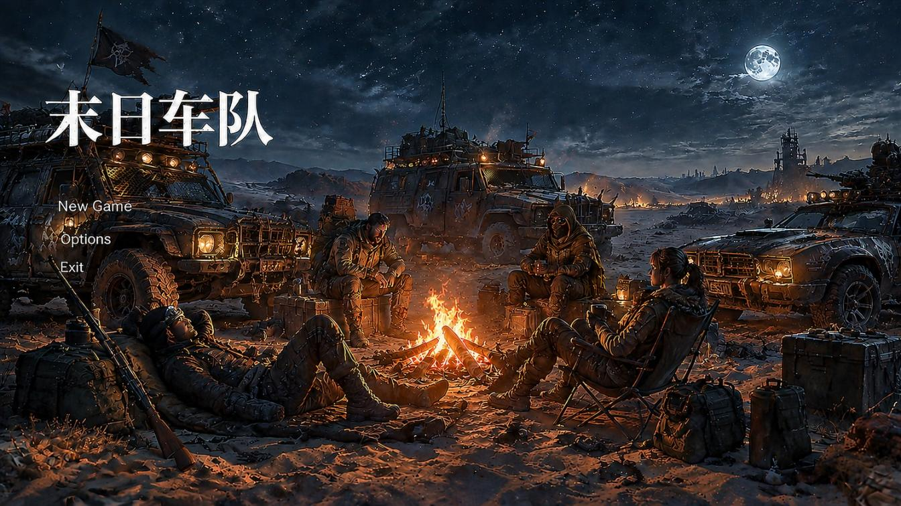

**说明**

画面元素：左上角中文标题「末日车队」；左侧竖排菜单项 New Game / Options / Exit；背景为夜晚荒野中休整的末日车队（篝火、四辆改装越野车、远处废墟与满月）。

交互说明（安卓触屏）：手指点按菜单项即选中并确认；当前选中项以高亮显示。

设计要点：背景留出左侧三分之一的暗部区域承载标题与菜单，保证文字可读；画面中不放置任何水印、徽标与版本号。

**图 02　设置 · 画面（Display）**

出现时机：主菜单 → Options

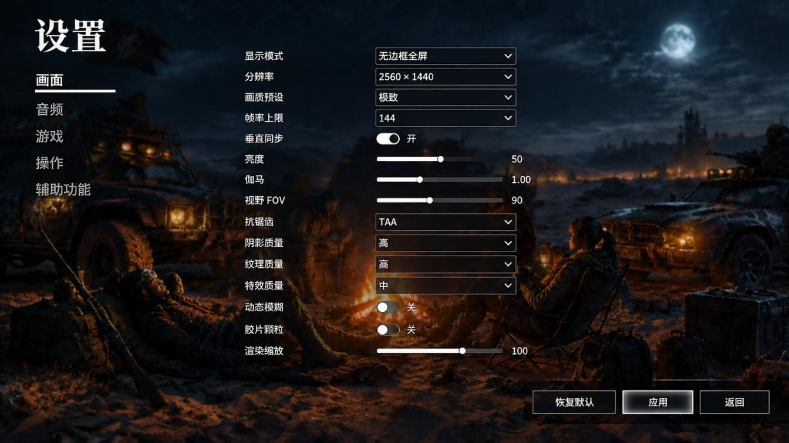

**说明**

包含项：显示模式（无边框全屏）、分辨率（2560×1440）、画质预设（极致）、帧率上限（144）、垂直同步（开）、亮度、伽马、视野 FOV、抗锯齿（TAA）、阴影质量、纹理质量、特效质量、动态模糊、胶片颗粒、渲染缩放。

控件规范：左列为中文标签，右列控件统一右对齐；下拉框用于枚举值，滑块带数值读数，开关显示 开 / 关。

底部按钮：恢复默认 / 应用 / 返回，其中「应用」为高亮主按钮。

**图 03　设置 · 音频（Audio）**

出现时机：设置 → 音频标签页

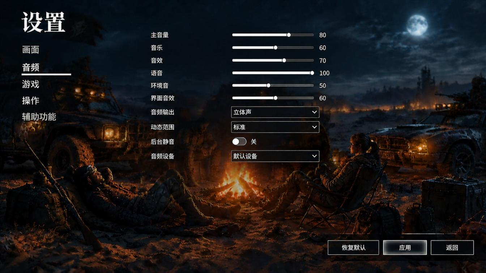

**说明**

包含项：主音量（80）、音乐（60）、音效（70）、语音（100）、环境音（50）、界面音效（60）、音频输出（立体声）、动态范围（标准）、后台静音（关）、音频设备（默认设备）。

设计要点：六条音量滑块成组排列，方便玩家一次性调平；数值直接显示在滑块右侧，不做二级菜单。

**图 04　设置 · 游戏（Gameplay）**

出现时机：设置 → 游戏标签页

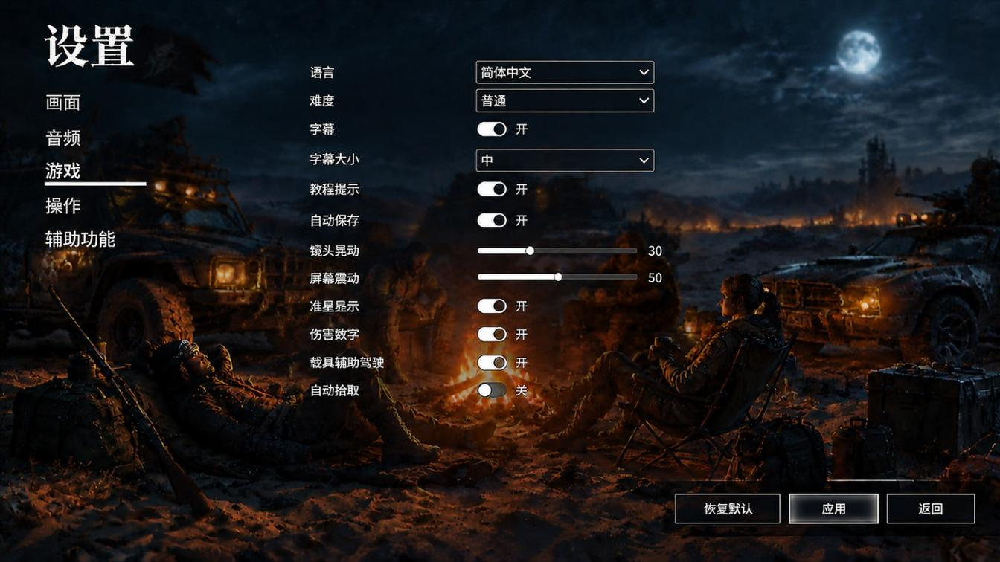

**说明**

包含项：语言（简体中文）、难度（普通）、字幕（开）、字幕大小（中）、教程提示（开）、自动保存（开）、镜头晃动（30）、屏幕震动（50）、准星显示（开）、伤害数字（开）、载具辅助驾驶（开）、自动拾取（关）。

设计要点：语言与难度放在最上方（最常改动的两项）；镜头晃动与屏幕震动提供数值化调节，兼顾晕动症玩家。

**图 05　设置 · 操作（Controls）**

出现时机：设置 → 操作标签页

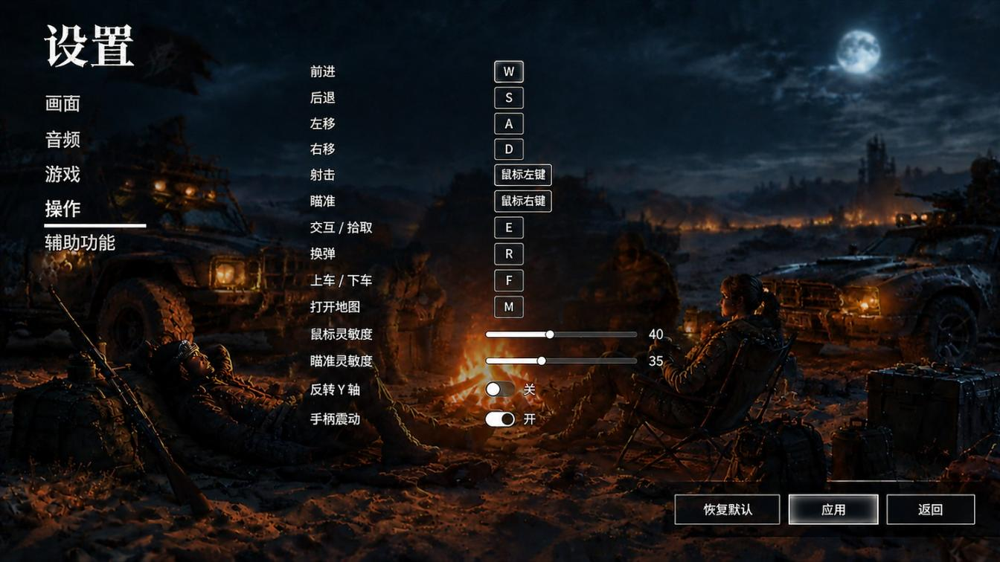

**说明**

包含项：前进 W、后退 S、左移 A、右移 D、射击（鼠标左键）、瞄准（鼠标右键）、交互 / 拾取 E、换弹 R、上车 / 下车 F、打开地图 M；下方为鼠标灵敏度（40）、瞄准灵敏度（35）、反转 Y 轴（关）、手柄震动（开）。

设计要点：键位行右侧直接显示键帽，点击键帽即可进入重绑定流程（见下一张图）。

**图 06　设置 · 键位重绑定（Rebind）**

出现时机：操作标签页 → 点击任意键位行

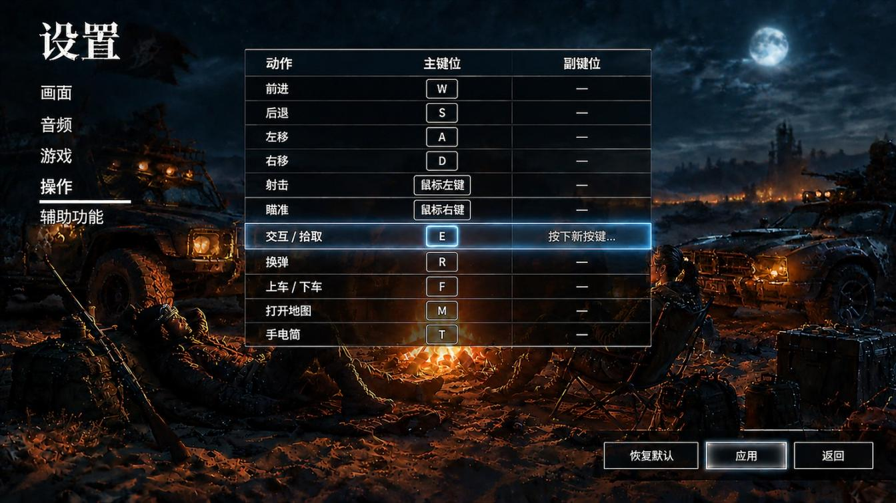

**说明**

表头三列：动作 / 主键位 / 副键位，每行一个动作，副键位默认留空（显示 —）。

当前状态：选中行「交互 / 拾取」整行高亮，右侧提示文字「按下新按键…」，表示正在监听键盘输入。

流程说明：点击键位 → 按下新按键 → 立即写入并退出监听；按 Esc 取消；若与已有键位冲突，需给出冲突提示并允许替换。

**图 07　设置 · 辅助功能（Accessibility）**

出现时机：设置 → 辅助功能标签页

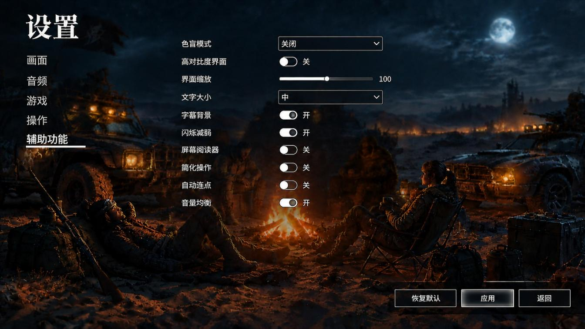

**说明**

包含项：色盲模式（关闭）、高对比度界面（关）、界面缩放（100）、文字大小（中）、字幕背景（开）、闪烁减弱（开）、屏幕阅读器（关）、简化操作（关）、自动连点（关）、音量均衡（开）。

设计要点：无障碍选项独立成页，不与画面、音频混排；每一项都用最直白的开关或档位，避免专业术语。

**图 08　设置 · 应用设置确认弹窗（Confirm）**

出现时机：设置页 → 点击「应用」

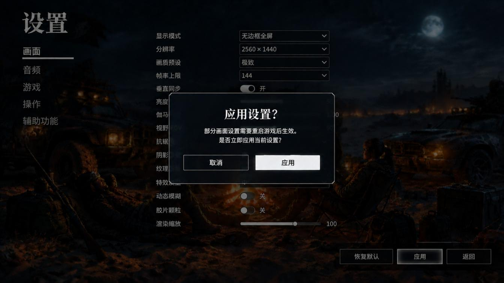

**说明**

弹窗标题：应用设置？

正文：部分画面设置需要重启游戏后生效。是否立即应用当前设置？

按钮：取消（暗色次按钮） / 应用（高亮主按钮）。

设计要点：背景设置界面整体压暗做模态遮罩，弹窗保持与游戏 UI 同款字体与描边，避免弹出系统原生对话框。

**图 09　启动 LOGO 画面**

出现时机：双击图标启动 → 第一屏

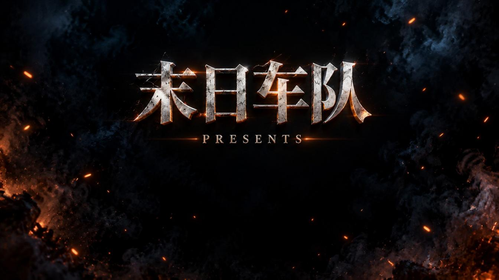

**说明**

画面元素：纯黑场；正中偏上为游戏主标识「末日车队」，金属磨砂质感 + 暖色边缘光；标识下方一行 PRESENTS；四周极暗烟雾与火星点缀。

交互说明：不可操作，展示 2–3 秒后自动进入下一屏；点击可加速。

设计要点：只留标识，不放任何按钮与版本号，用于建立开篇氛围。

**图 10　标题画面**

出现时机：启动 LOGO 之后 → 主菜单之前

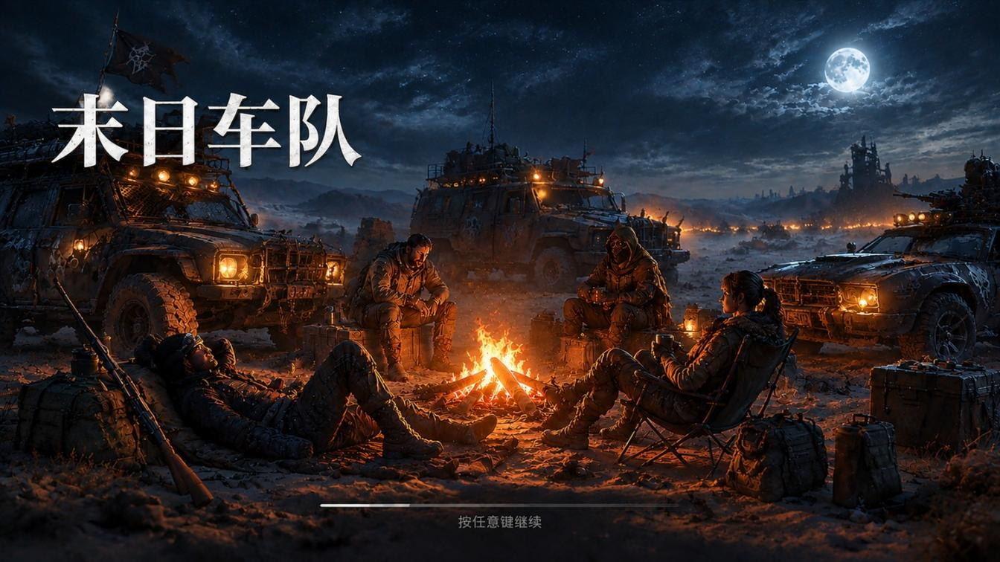

**说明**

画面元素：与主菜单同款夜景车队背景（偏暗、轻微虚化）+ 左上角标题「末日车队」；底部中央一条极细加载进度条与一行灰色小字：按任意键继续。

交互说明：按任意键或点击进入主菜单。

设计要点：与主菜单共用背景，减少一次资源加载；除标题与提示外不出现菜单项，让首次进入更安静。

**图 11　存档选择（新游戏 / 继续 / 读取）**

出现时机：主菜单 → New Game（或「继续游戏」「读取存档」）

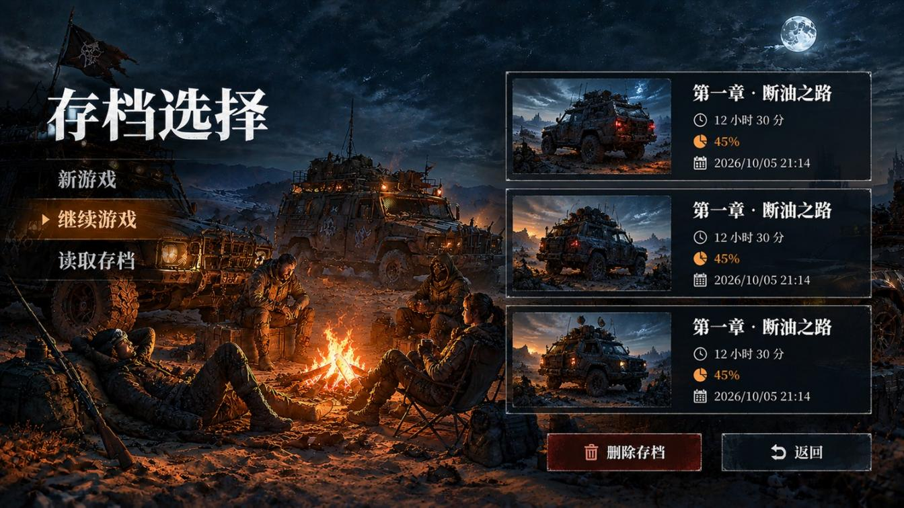

**说明**

画面元素：左侧竖排三项：新游戏 / 继续游戏 / 读取存档，当前「继续游戏」高亮；右侧三张存档卡片，每张含章节名、游玩时长、进度百分比、保存时间与车辆缩略图；底部按钮 删除存档 / 返回。

交互说明：选卡片读取；删除存档需二次确认。

备注：本图中三张存档卡片数据一致（生成时的瑕疵），正式版应各不相同——差异化的示范见「图 21 存档 / 读档界面」。

**图 12　序章剧情对话**

出现时机：新游戏 → 第一段剧情

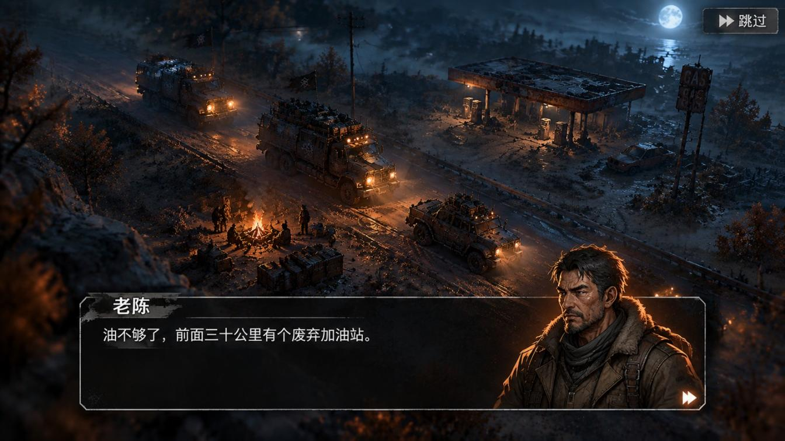

**说明**

画面元素（HD-2D 俯视）：斜 45 度俯视的夜间荒野公路与路边停靠的车队，可见车顶与路面车辙，远处是废墟剪影；下方对话框（半透明深色面板 + 细白描边），说话人「老陈」+ 一行对白：油不够了，前面三十公里有个废弃加油站。对话框右侧为 2D 半身立绘；右上角「跳过」按钮；右下角闪烁的继续三角标。

交互说明（安卓触屏）：点按屏幕任意位置推进对白；点按「跳过」可整段跳过。

设计要点：对话框占屏幕下方约四分之一，不遮挡立绘与场景；说话人名字与正文用字号和灰度区分。

**图 13　新手教学引导（安卓触屏版）**

出现时机：序章剧情结束 → 进入第一关

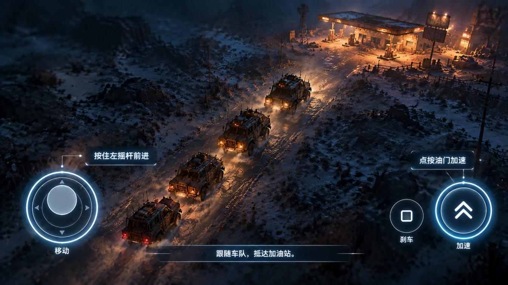

**说明**

画面元素（安卓手机版 · HD-2D 俯视）：斜 45 度俯视的夜间荒野公路，车队朝远处加油站行进，可见车顶与车辙；左下角为虚拟摇杆，圆形底盘 + 摇杆头，标注「移动」；右下角两个圆形虚拟按钮——较大的油门（向上双箭头图标，标注「加速」）与较小的刹车（标注「刹车」）。摇杆底盘与油门按钮外圈各有一圈脉动高亮光环，旁边分别浮出提示文字「按住左摇杆前进」「点按油门加速」。底部半透明提示条：跟随车队，抵达加油站。

交互说明：玩家完成对应触屏操作后提示自动消失；教学期间不刷新敌人；屏幕顶部与底部预留安全边距，适配刘海全面屏与手势条。

设计要点：移动端不出现任何键盘键帽与鼠标图标；一次最多教两个操作，提示直接贴在对应控件旁，不用长段文字说明；摇杆与按钮的位置、大小均可自定义（对应设置页的触屏布局选项）。

**图 14　车队营地 / 车库管理**

出现时机：关卡结算后回到营地

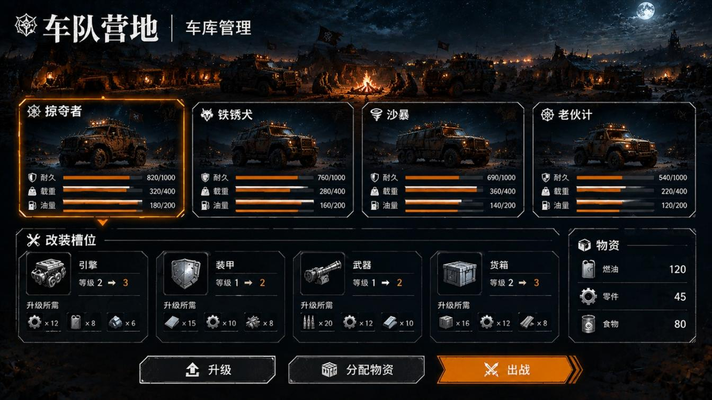

**说明**

画面元素：上半部四辆车卡片——掠夺者 / 铁锈犬 / 沙暴 / 老伙计，每张含耐久条、载重、油量，当前「掠夺者」高亮；下半部改装槽位面板——引擎 / 装甲 / 武器 / 货箱，每格显示当前等级与升级所需材料；右下角物资：燃油 120、零件 45、食物 80；底部按钮 升级 / 分配物资 / 出战。

交互说明：点卡片切换车辆，点槽位消耗材料升级；「出战」进入大地图。

设计要点：车辆状态（耐久、载重、油量）用同一种条状图，横向对比一眼可读。

**图 15　大地图 / 路线选择**

出现时机：营地 → 出战

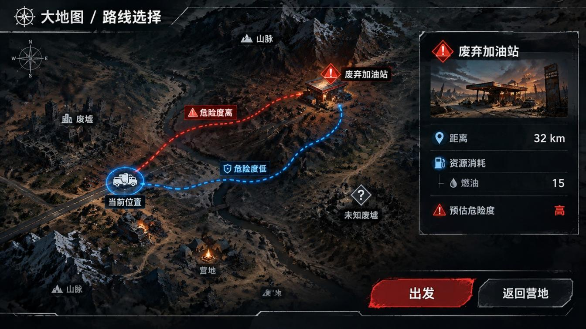

**说明**

画面元素：俯视手绘质感废土区域地图，标注山脉、废墟、营地；三个节点——当前位置（车队图标，高亮）、废弃加油站（目标，带感叹号）、未知废墟（问号）；两条路线分别为「危险度高」（近）与「危险度低」（远）；右侧信息面板：距离 32 km、资源消耗 燃油 15、预估危险度 高；底部按钮 出发 / 返回营地。

交互说明：先选目的地节点，再选路线，确认后扣除燃油并出发。

设计要点：风险与消耗直接摆在同一屏，让玩家在出发前做一次明确取舍。

**图 16　关卡内 HUD**

出现时机：关卡进行中（驾驶赶路）

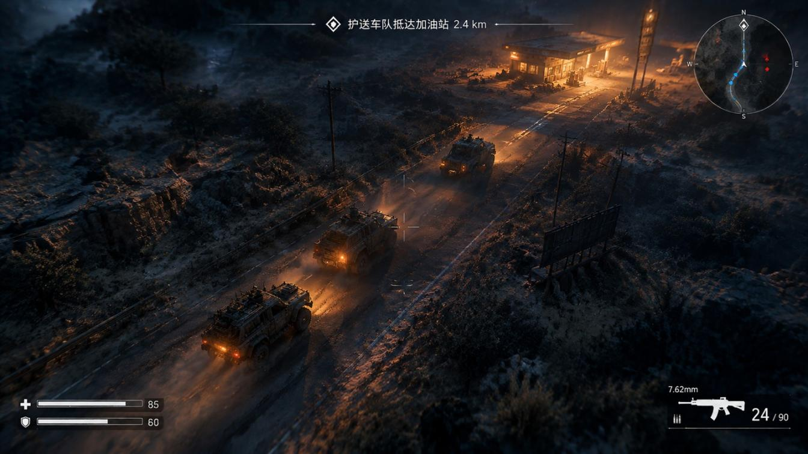

**说明**

画面元素（HD-2D 俯视）：斜 45 度俯视的夜间荒野公路，车队行驶于公路上，镜头在车队上方偏后，可见车顶、车辙与两侧荒草；HUD 全部细线条半透明白色——左下角血条 / 护甲条（85 / 60），右下角弹药 7.62mm 24 / 90 与武器图标，右上角圆形小地图（道路、队友蓝点、敌人红点），上方居中任务目标：护送车队抵达加油站 2.4 km，屏幕中央细小准星。

交互说明：HUD 常驻，血量低于阈值时血条转红并闪烁。

设计要点：四角布局把屏幕中心完全留给场景；小地图用蓝 / 红两点区分敌我，不写文字。

**图 17　战斗与载具驾驶（偶发遭遇 · 非核心玩法）**

出现时机：关卡中遭遇掠夺者伏击

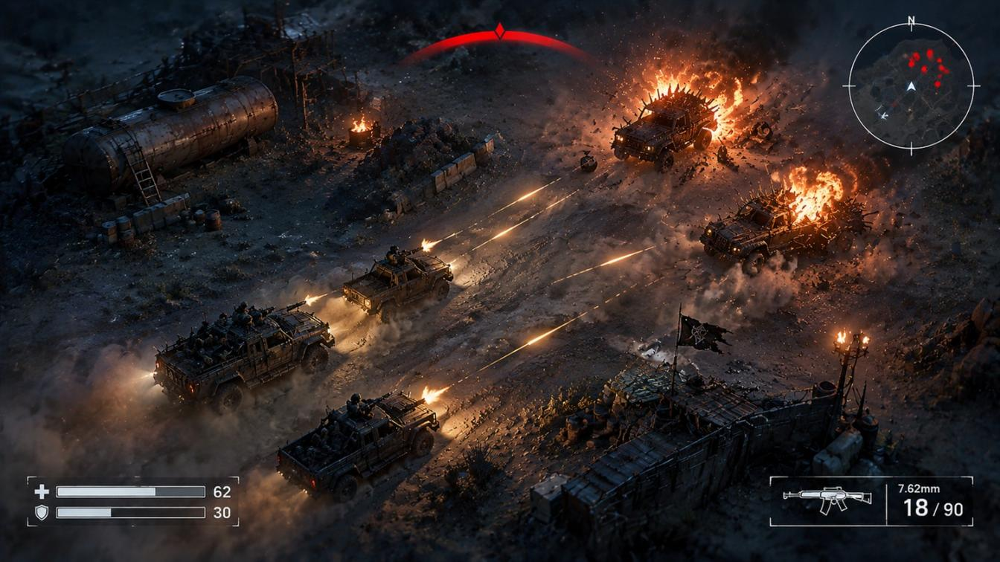

**说明**

画面元素（HD-2D 俯视）：斜 45 度俯视的夜间荒野战场，车队与两辆掠夺者改装车交火，曳光弹斜向穿梭，两辆敌方车被击中起火爆炸、碎片与烟尘四散；镜头在战场上方，可同时看到双方车辆与掩体（废弃油罐、路障）；带轻微动态模糊与镜头震动感。HUD 同上一节点，但血条红色告警（62 / 30），弹药 18 / 90，小地图出现多个红点，屏幕上方显示受击方向指示弧。

交互说明：受击时屏幕边缘出现方向指示，提醒玩家转向规避。

设计要点：火光与爆炸是画面最亮处，UI 保持在暗部，避免与特效抢视觉焦点。

**图 19　技能 / 装备升级树**

出现时机：营地内 → 升级

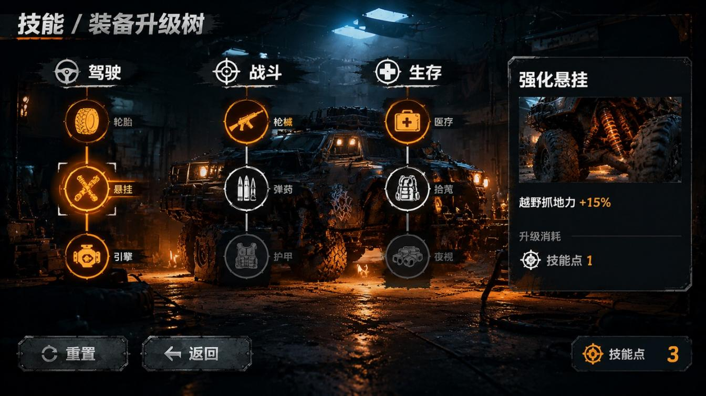

**说明**

画面元素：背景为压暗的夜间车库，一辆改装车停在中央；三条纵向技能分支——驾驶（轮胎 / 悬挂 / 引擎）、战斗（枪械 / 弹药 / 护甲）、生存（医疗 / 拾荒 / 夜视）；已解锁节点暖橙实心、可解锁白色描边、未解锁暗灰；当前选中「强化悬挂」，右侧详情显示 越野抓地力 +15%、升级消耗 技能点 1；右下角技能点 3；底部按钮 重置 / 返回。

交互说明：点可解锁节点消耗技能点；「重置」退还全部技能点。

设计要点：三条分支各九个节点以内，用颜色而非文字表示解锁状态。

**图 20　暂停菜单**

出现时机：关卡内点按暂停按钮

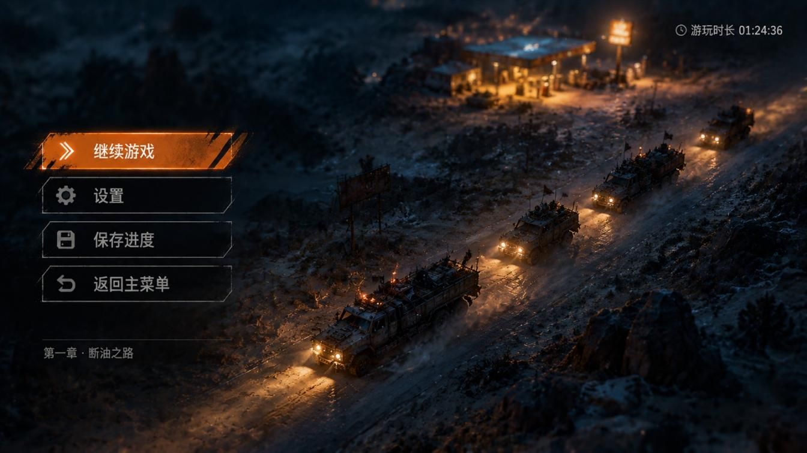

**说明**

画面元素（HD-2D 俯视）：背景为斜 45 度俯视的夜间车队行驶画面，做深度虚化与压暗；左侧竖排四项——继续游戏 / 设置 / 保存进度 / 返回主菜单，当前「继续游戏」高亮；下方灰色小字显示章节：第一章 · 断油之路；右上角游玩时长 01:24:36。

交互说明（安卓触屏）：点按左上角暂停按钮打开，手机返回键或「继续游戏」关闭；「设置」跳转到图 02–08 的设置界面；「保存进度」跳转到图 21。

设计要点：暂停用虚化而不是纯黑遮罩，保留玩家的沉浸感与位置感。

**图 21　存档 / 读档界面**

出现时机：暂停菜单 → 保存进度

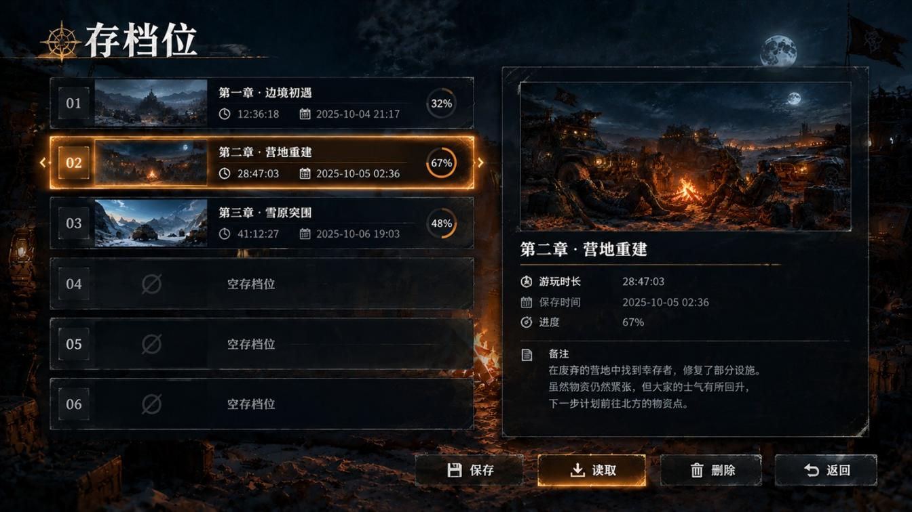

**说明**

画面元素：左栏「存档位」六个槽位，前三个存档数据各不相同（32% / 67% / 48%，章节与时间均不同），后三个显示「空存档位」；右栏为所选存档详情——场景缩略图、章节名、游玩时长、保存时间、进度与一段备注文字；当前选中第 2 个槽位并高亮；底部按钮 保存 / 读取 / 删除 / 返回。

交互说明：选中空位保存，选中已有存档可覆盖或读取；删除需二次确认。

设计要点：与图 11 的存档选择页共用卡片样式，但这里多了备注与手动保存按钮，区分「读档」与「存档」两种意图。

**图 22　退出确认弹窗**

出现时机：主菜单 → Exit

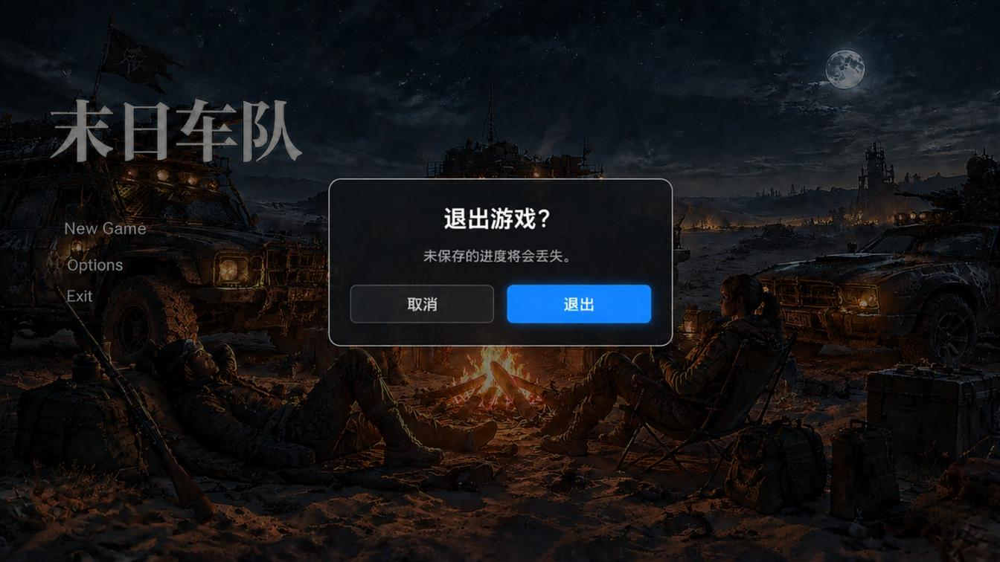

**说明**

画面元素：主菜单整体覆盖半透明黑色模态遮罩；居中弹窗（深色半透明面板、圆角、细白描边），标题「退出游戏？」，正文一行灰色小字：未保存的进度将会丢失。底部两个并排按钮：取消（暗色次按钮） / 退出（高亮主按钮）。

交互说明（安卓触屏）：点按「取消」或手机返回键返回主菜单；确认后关闭游戏。

设计要点：与图 08 的「应用设置」弹窗共用同一套弹窗规范，保证全局一致。

**图 23　休息点 · 自由探索（2D 侧视 · 操控队长）**

出现时机：抵达休息点 → 可自由走动

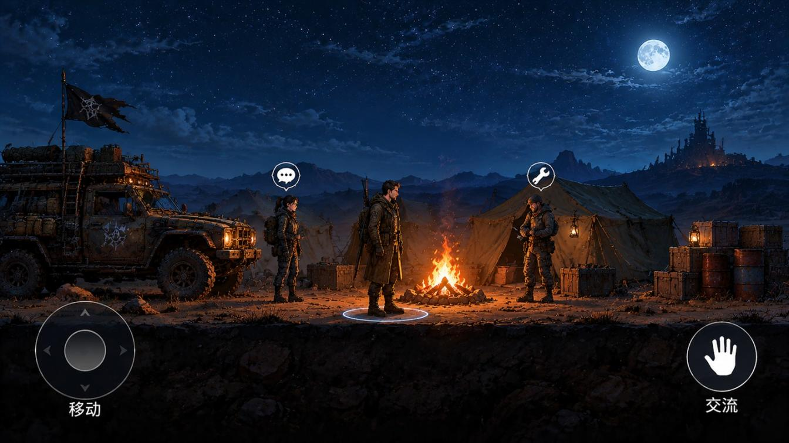

**说明**

画面元素：2D 横版侧视的夜间休息点——地平线位于画面下方三分之一，地面为侧视地表剖面；左侧是改装越野车的正侧面（可见轮胎、车顶行李架与旗子），中央为篝火与两顶帐篷的侧面剪影，右侧堆放木箱与油桶。队长以正侧面姿态站在篝火前，脚下有半透明选中光圈，表示当前可操控；两名队友侧身站在不同位置，头顶挂着交互图标（对话气泡、扳手）。左下角虚拟摇杆（移动），右下角交互按钮（交流）。

交互说明：摇杆控制队长左右走动，靠近队友或可交互点时图标亮起，点按「交流」进入对话或交互。

设计要点：这是全游戏的核心场景——所有选择都发生在这里；可交互点用图标而非文字提示，保证侧视画面干净。

**图 24　休息点 · 与队友对话（2D 侧视 · 分支选择）**

出现时机：靠近队友 → 点按「交流」

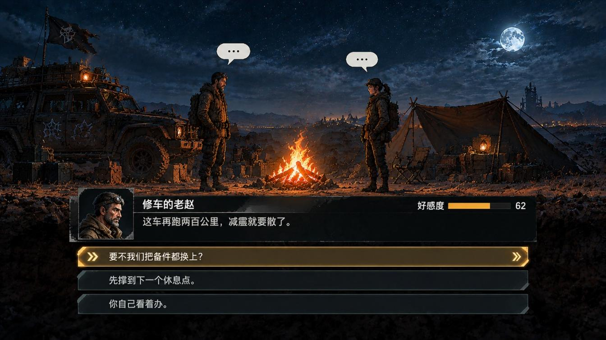

**说明**

画面元素：队长与队友以正侧面姿态面对面站在篝火旁，两人头顶各有一个对话气泡；背景是帐篷与越野车的侧面剪影。下方对话框：说话人「修车的老赵」+ 一行对白：这车再跑两百公里，减震就要散了。对话框右侧显示关系：好感度 62（细条 + 数值）。对话框下方竖排三个选项条，第一项高亮。

选项示例：要不我们把备件都换上？ / 先撑到下一个休息点。 / 你自己看着办。

交互说明：点按选项即生效，结果立即反映到好感度与后续事件；对话不可回退。

设计要点：每次对话只给 2–3 个选项，选项之间是「代价不同」而不是「对错不同」。

**图 25　休息点 · 物资分配（上帝视角 · 取舍）**

出现时机：休息点 → 分配物资

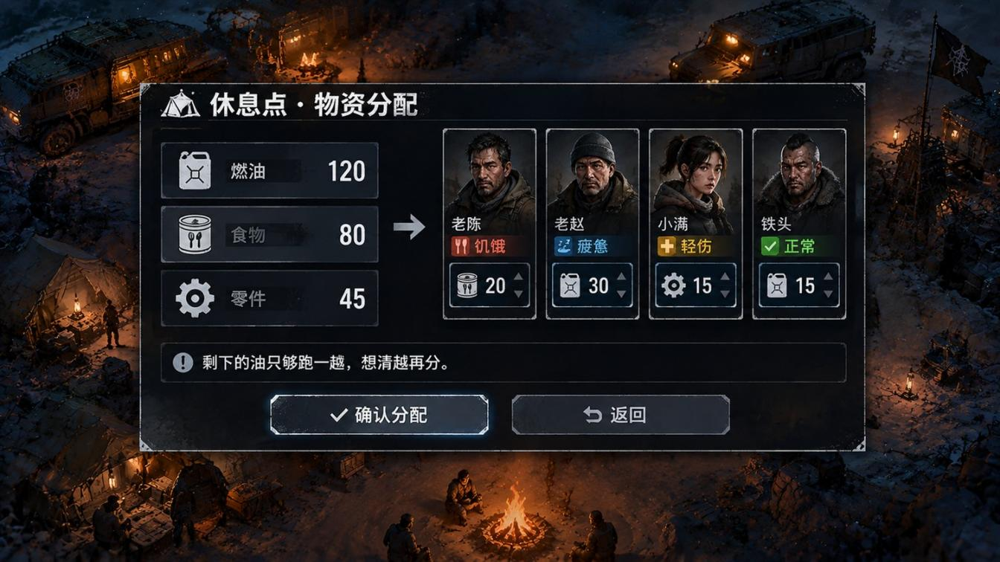

**说明**

画面元素：背景为斜 45 度俯视的夜间休息点（压暗虚化）。居中为物资分配面板：左列 燃油 120 / 食物 80 / 零件 45；右侧四张队员卡片（老陈 / 老赵 / 小满 / 铁头）带状态标签（饥饿 / 疲惫 / 轻伤 / 正常）与已分配数额；底部提示：剩下的油只够跑一趟，想清楚再分。按钮：确认分配 / 返回。

设计要点：物资总量永远不够分，这是本作最主要的取舍界面——把有限的油和食物给谁，直接决定下一段路谁能扛住。

**图 26　与其他车队碰面（2D 侧视 · 操控队长上前）**

出现时机：赶路途中或休息点 → 遇到其他车队

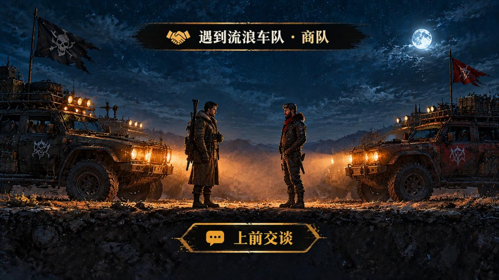

**说明**

画面元素：2D 横版侧视的夜间公路——左侧我方越野车正侧面（黑色骷髅旗），右侧陌生车队车辆正侧面（红色三角旗），两队车灯在中间空地对射；队长与对方头领以正侧面姿态面对面交谈，双方枪都收着。顶部事件提示条：遇到流浪车队 · 商队；底部按钮：上前交谈。

交互说明：点按「上前交谈」进入交易；也可以选择不开谈、直接离开（关系不变，但错过物资机会）。

设计要点：碰面的默认状态是「不打」——要不要谈，由玩家决定。

**图 27　交易界面（上帝视角 · 以物易物）**

出现时机：碰面 → 上前交谈

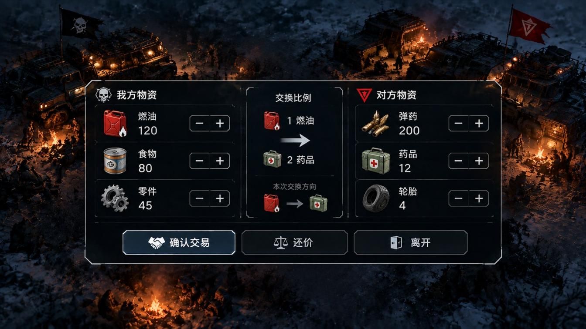

**说明**

画面元素：背景为斜 45 度俯视的两支车队停靠（压暗虚化）。居中交易面板左右分栏：我方物资 燃油 120 / 食物 80 / 零件 45；对方物资 弹药 200 / 药品 12 / 轮胎 4；中间显示交换比例 1 燃油 = 2 药品 与本次交换方向。按钮：确认交易 / 还价 / 离开。

设计要点：只做以物易物，不引入货币；交换比例直接写出来，避免玩家算不清账。

**图 28　交易谈判（2D 侧视 · 讨价还价）**

出现时机：交易界面 → 还价

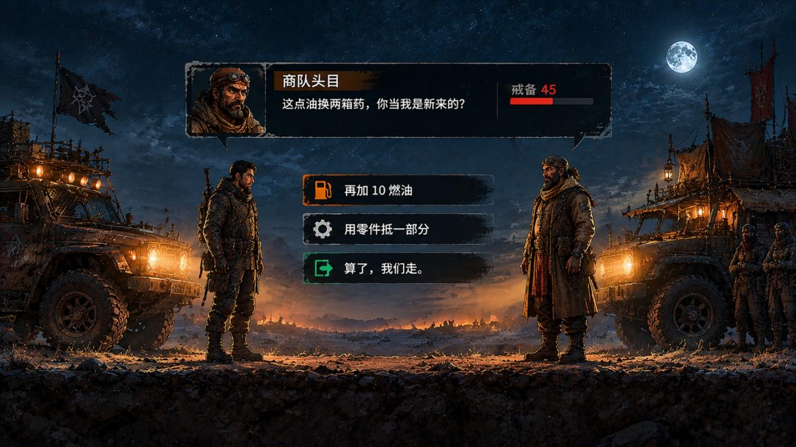

**说明**

画面元素：2D 横版侧视的夜间荒野，两队车辆正侧面停靠于画面左右，车灯照向中间空地，队长与商队头目以正侧面姿态面对面站立。居中谈判弹窗：说话人「商队头目」+ 对白：这点油换两箱药，你当我是新来的？弹窗右侧显示对方关系：戒备 45（红色条 + 数值）。下方三个选项条：再加 10 燃油 / 用零件抵一部分 / 算了，我们走。

交互说明：还价会消耗对方耐心（戒备值上升），失败则交易取消；对方关系随每次谈判变化，并影响后续章节的遭遇。

设计要点：谈判是「读对方态度」的过程，玩家要看着戒备值决定什么时候收手。

**图 29　选择结果反馈（上帝视角 · 变化结算）**

出现时机：任何一次选择之后

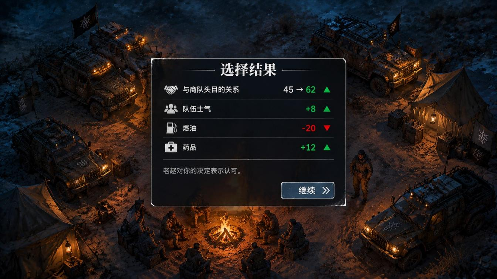

**说明**

画面元素：背景为斜 45 度俯视的夜间休息点（篝火、帐篷、四辆越野车），略微压暗；中央浮出结果面板：标题「选择结果」，逐行显示 与商队头目的关系 45 → 62（绿色上升）、队伍士气 +8、燃油 -20（红色）、药品 +12，末行小字备注：老赵对你的决定表示认可。面板右下角按钮：继续。

设计要点：每次选择都用同一张面板给出明确的数值变化，让玩家清楚「刚才那一下换来了什么」。

**图 30　队伍与关系（上帝视角 · 关系总览）**

出现时机：休息点 → 查看队伍

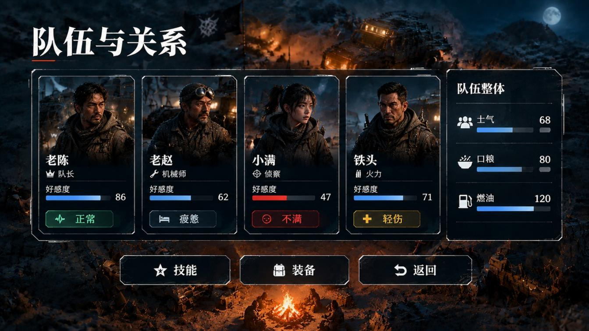

**说明**

画面元素：背景为斜 45 度俯视的夜间休息点（压暗虚化）。居中队伍面板：四张队员卡片（老陈 · 队长 / 老赵 · 机械师 / 小满 · 侦察 / 铁头 · 火力），各含头像、好感度条与数值（86 / 62 / 47 / 71）与状态标签（正常 / 疲惫 / 不满 / 轻伤），其中「小满」的好感度条偏红表示关系紧张；右侧一栏显示队伍整体：士气 68、口粮 80、燃油 120。按钮：技能 / 装备 / 返回。

设计要点：好感度是长期变量，玩家的每一次选择都会在这里留下痕迹。

**图 31　场景库 · 营房帐篷内（队长召集重要人员）**

出现时机：休息点 → 召集会议（可替换场景 1/6）

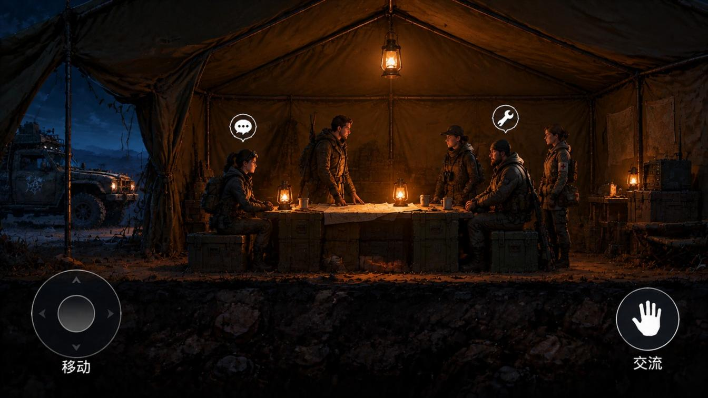

**说明**

画面元素：2D 横版侧视的帐篷内部剖面——可见帐篷骨架、拉绳与吊灯；正中一张由弹药箱拼成的长桌，摊着地图、两盏马灯与搪瓷杯。队长以正侧面姿态站在桌侧、一手按在地图上；四名队员侧身围桌而坐或站立（机械师 / 侦察 / 火力手 / 医护），全部看着他。帐篷口透进越野车的侧面轮廓与冷蓝夜色，主光源是马灯的暖黄光。

用途：重要会议、章节节点、关键抉择前的集体讨论——与图 24 的对话系统共用同一套 UI。

设计要点：帐篷是「室内」，视线更封闭，用来强调这次谈话的重量；队长站在桌边而不是坐着，保持指挥者姿态。

**图 32　场景库 · 篝火旁作战会（露天）**

出现时机：休息点 → 露天会议（2/6）

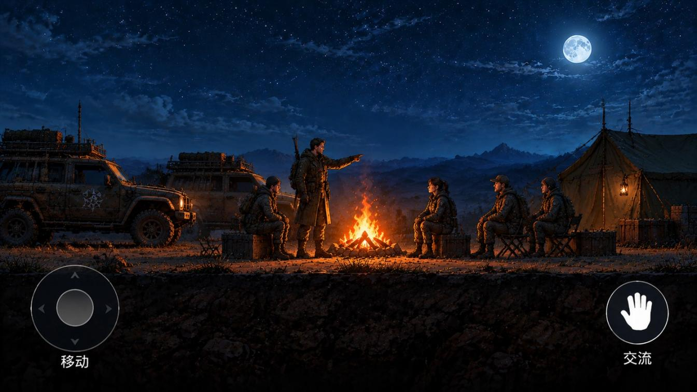

**说明**

画面元素：篝火居中；队长以正侧面姿态站立、抬手指向远处，四名队员侧身围坐在木箱与折叠椅上抬头看他；背景是两辆越野车的正侧面与帐篷剪影，夜空有月。地面为侧视剖面，篝火是唯一主光源。

用途：出发前的路线布置、士气动员；也适合安排「决定下一步去哪」这类群体选择。

**图 33　场景库 · 废弃加油站（休息点）**

出现时机：赶路途中扎营（3/6）

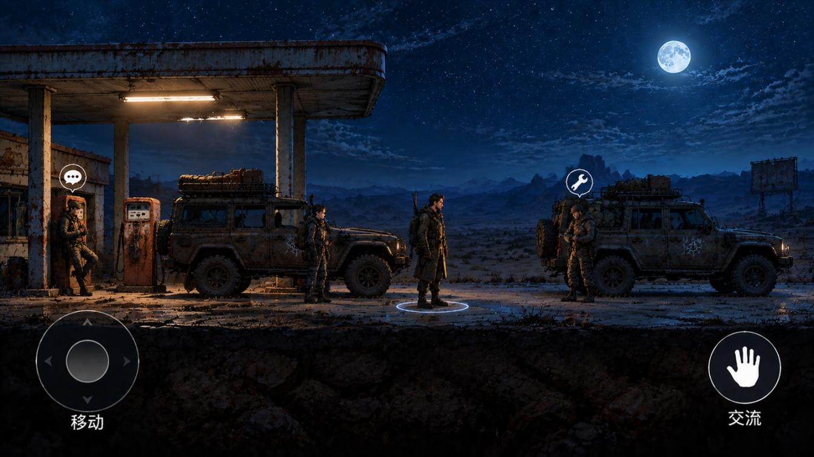

**说明**

画面元素：雨棚与两台锈蚀加油机的正侧面，棚下一盏日光灯忽明忽暗；我方两辆车侧停在棚下，队长与三名队员侧身站在车旁，一人靠着加油机。地面是开裂水泥地的侧视剖面，远处是荒漠与冷蓝夜空。

用途：补给点剧情、遇到其他车队的常见地点；日光灯与车灯构成第二光源，适合做「停电」类突发事件。

**图 34　场景库 · 隧道口避风（休息点）**

出现时机：恶劣天气扎营（4/6）

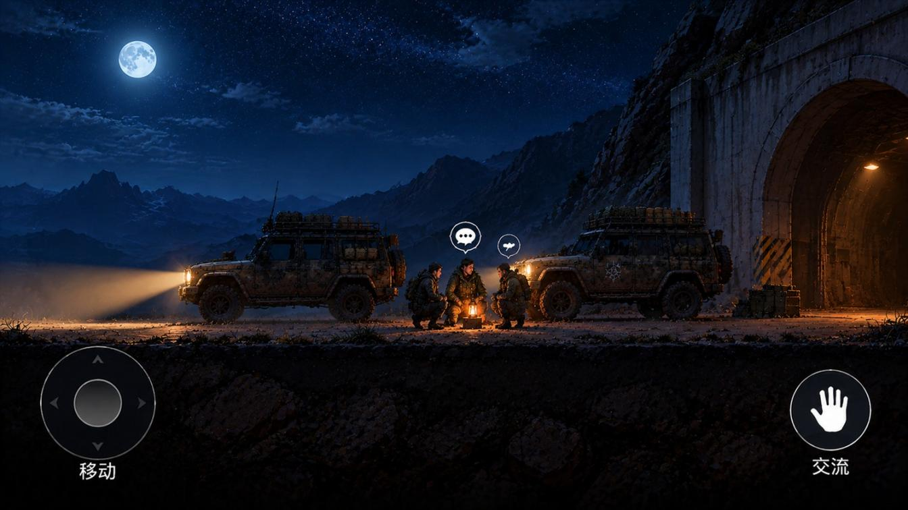

**说明**

画面元素：右侧是隧道入口的混凝土侧面与拱形洞门，洞内透出微弱暖光；两辆车侧停在洞外，队长与两名队员围着一盏马灯蹲坐，车灯向画面左侧射出光束照亮路面。地面为侧视剖面，背景是冷蓝夜色下的山体轮廓。

用途：风雪 / 沙暴天气的临时避难点，适合安排「守夜」「有人掉队」类小事件。

**图 35　场景库 · 雪原营地（休息点）**

出现时机：雪原章节扎营（5/6）

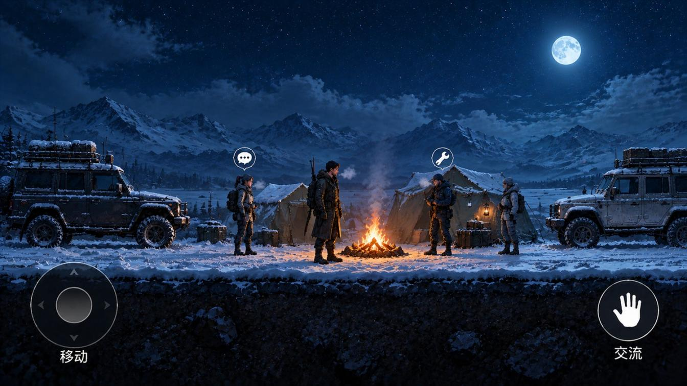

**说明**

画面元素：积雪地面呈侧视剖面、能看清雪层与车辙；两辆车侧停在画面左右、车顶与行李架积雪；中央一堆篝火与两顶覆雪帐篷，队长与三名队员侧身围火，呼出的白气可见。背景是冷蓝夜色与雪原远山，月光为次要光源。

用途：低温章节，可挂接「燃料消耗加倍」「有人冻伤」等状态，让物资分配的取舍更紧张。

**图 36　场景库 · 中立集市（多车队交易）**

出现时机：中立区 → 交易（6/6）

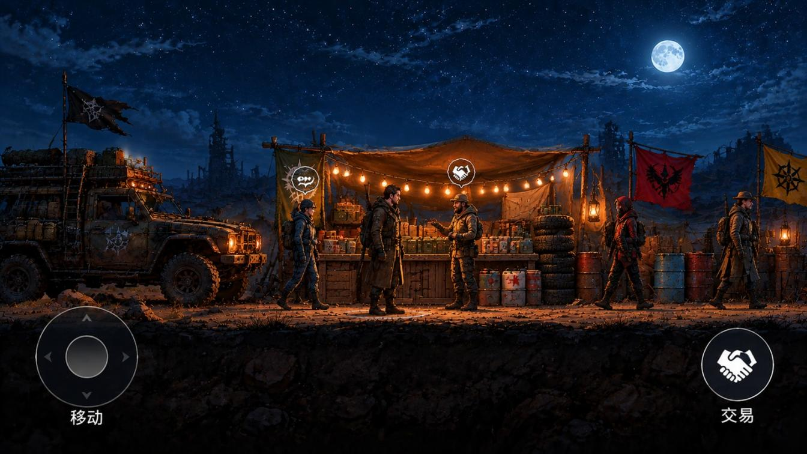

**说明**

画面元素：一排木板与帆布摊位的正侧面，摊上堆着弹药箱、油桶、轮胎与药品箱，棚顶挂一串暖色小灯；三支不同车队的人侧身走动交谈（旗帜与服装各异），队长侧身站在摊前与人交涉，我方越野车侧停在画面左侧；右下角交互按钮显示「交易」。

用途：多车队同时出现的交易场，比单独碰面更适合做「比价」「选边站」的选择。

设计要点：三面不同的旗子就是三次潜在的关系选择——站在谁那边买，另一边的态度会变。

**图 37　结局 · 共同体抵达**

出现时机：触发条件：仍有足够人口，并形成共同语言或制度

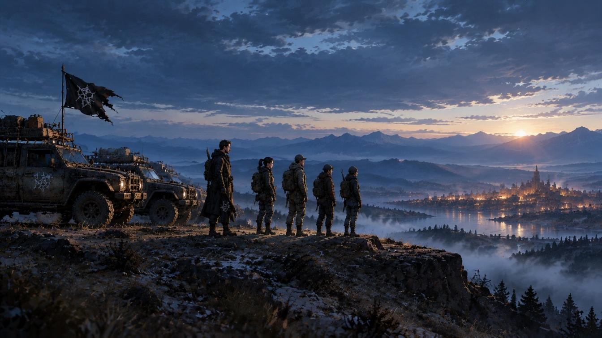

**说明**

画面：灰蓝黎明，三辆车停在高地边缘，全体成员下车并肩望向远方山谷——那里有一片完整的聚落灯火与水面反光；有人把黑色骷髅旗降下收在手里。

情绪：辽阔、安静，是「终于到了」的那一口气。主色灰蓝，远处暖色灯火是唯一亮点。

结局说明：车队带回了人，也带回了共同的规矩——不只是一个地方，而是一群人愿意继续在一起。

**图 38　结局 · 新聚落**

出现时机：触发条件：车队停止前进，在某处建立稳定社区

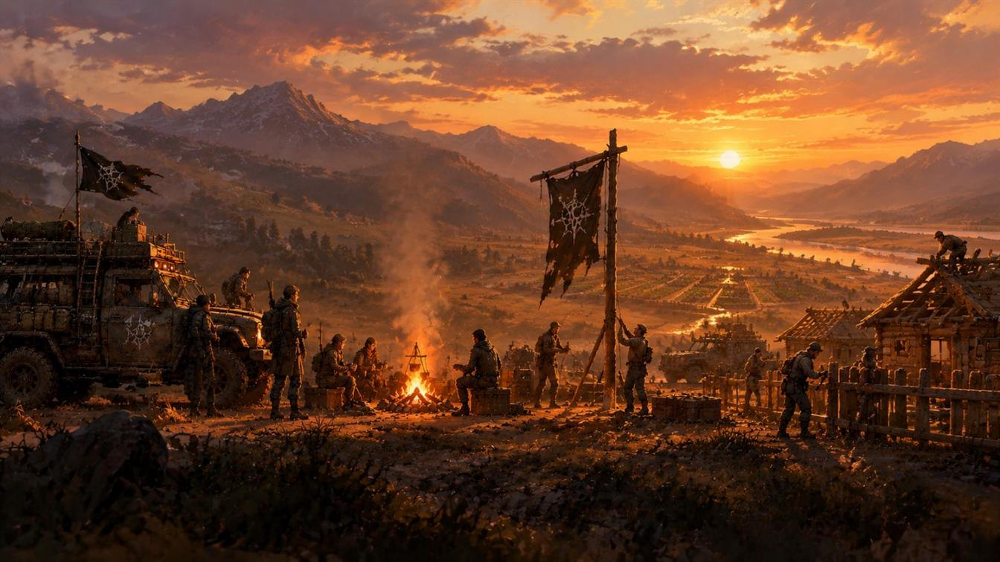

**说明**

画面：黄昏河谷平地，车辆围成半圆，人们搭建木屋与围栏，新立的木杆上挂着还没缝好的旗；篝火升起炊烟，远处有开垦出的条状土地。

情绪：「不走了，就在这儿。」主色暖橙与土黄。

结局说明：目的地不再是唯一的答案——把车停下、把地种上，也是一种抵达。

**图 39　结局 · 车队分裂**

出现时机：触发条件：不同群体带着各自资源与文化离开

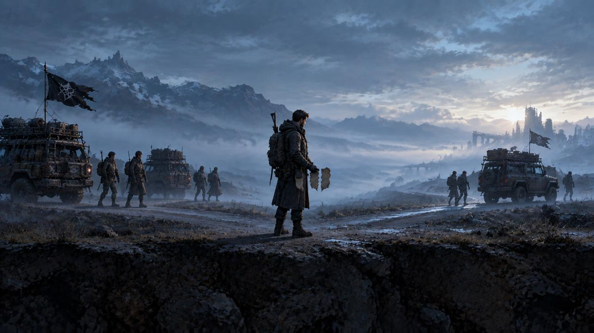

**说明**

画面：清晨薄雾的岔路口，两支队伍各带车辆朝相反方向离去；队长独自站在岔路中央，手里握着一张撕成两半的地图。

情绪：没有争吵，只有分开。主色灰蓝，全图无暖光。

结局说明：语言、路标、分配方式的分歧累积到最后，就是一条岔路。

**图 40　结局 · 并入他者**

出现时机：触发条件：车队与另一个幸存者聚落合并

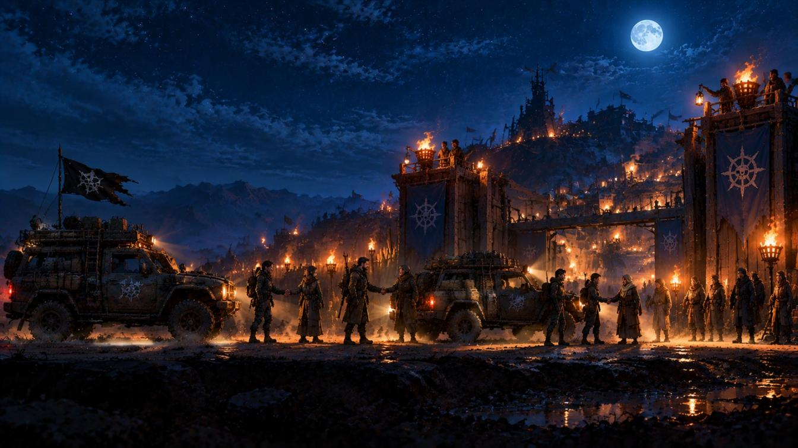

**说明**

画面：夜晚，我方车队驶入一座大型聚落的大门，岗楼提灯与沿路火把把整条路照亮，双方在门口握手。

情绪：被接纳，但也不再完全是自己。主色冷蓝夜色 + 密集暖色灯火。

结局说明：活下来的方式之一，是成为别人的一部分。

**图 41　结局 · 孤独抵达**

出现时机：触发条件：只剩队长一人，但他成功找到安全处

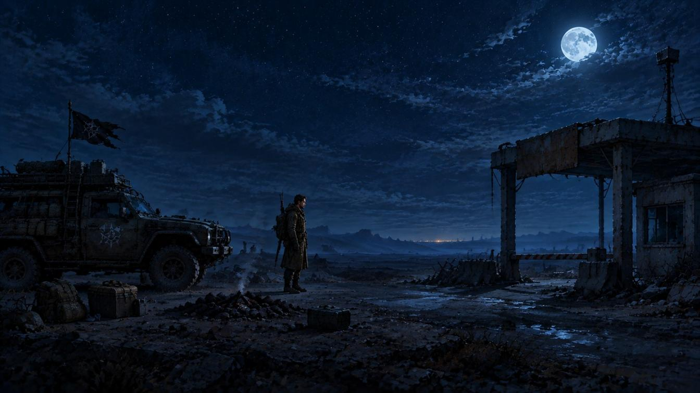

**说明**

画面：深夜，队长一人站在废弃检查站前；身后是熄了火的空车、冷掉的篝火与散落的行囊，画面里没有其他人。远处地平线只有一线极微弱的灯光。

情绪：极安静、极空。主色深蓝，几乎无暖光。

结局说明：他到了，但没有人可以告诉他「我们到了」。

**图 42　结局 · 车队之王**

出现时机：触发条件：车辆、燃料与武器集中到少数人手中，队长建立强制秩序

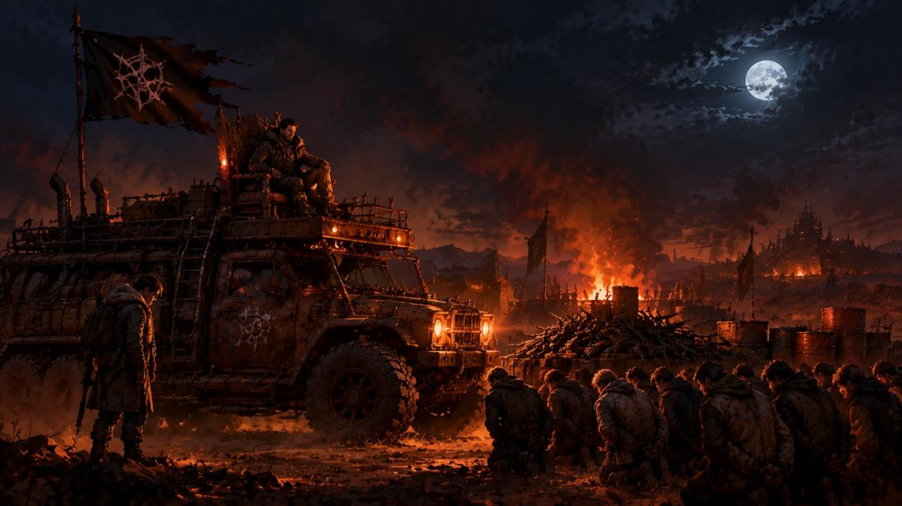

**说明**

画面：夜晚，队长的座椅被焊在主车车顶，他坐在上面俯视下方；车下是被缴械的人群与堆成小山的武器、油桶，黑色骷髅旗在车尾高扬。

情绪：压迫感——队长在最高处，其余人在下方。主色暗红与铁锈色。

结局说明：秩序建立起来了，代价是车队从此只剩一个声音。

**图 43　结局 · 流动车库**

出现时机：触发条件：车队放弃目的地，靠维修与交易成为移动服务聚落

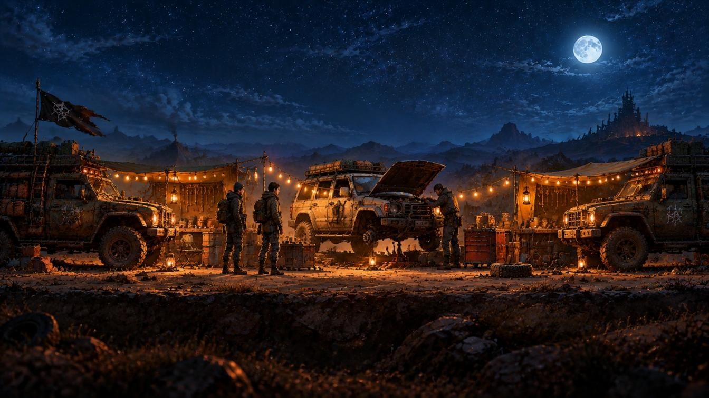

**说明**

画面：夜晚，三辆车围成半圆，车与车之间拉起一串暖色小灯、挂着工具与零件；一辆外来车停在中间正被举升维修，两名外来司机在旁边等着，地上摆着油桶、轮胎与零件箱。

情绪：热闹、务实。主色暖橙。

结局说明：不往前走了，但路过的每一支车队都需要他们。

**图 44　结局 · 无车之民**

出现时机：触发条件：车辆全部损失，徒步群体形成低噪音、低消耗的共同体

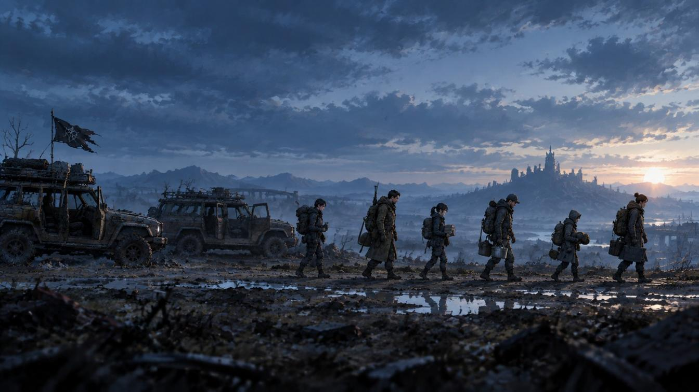

**说明**

画面：灰蓝清晨，两辆走不动的车停在画面后方，车门敞开、轮胎半陷在泥里；人们背着行囊、扛着书籍与锅具，排成一列沿公路徒步走向右侧，没有人回头。

情绪：安静、整齐、克制。主色灰蓝，只有一点晨光。

结局说明：失去了车，却换来了安静与低消耗——他们学会了不被听见地活着。

**图 45　结局 · 敌影同行**

出现时机：触发条件：车队利用敌对存在的规律建立新的路线与生存仪式

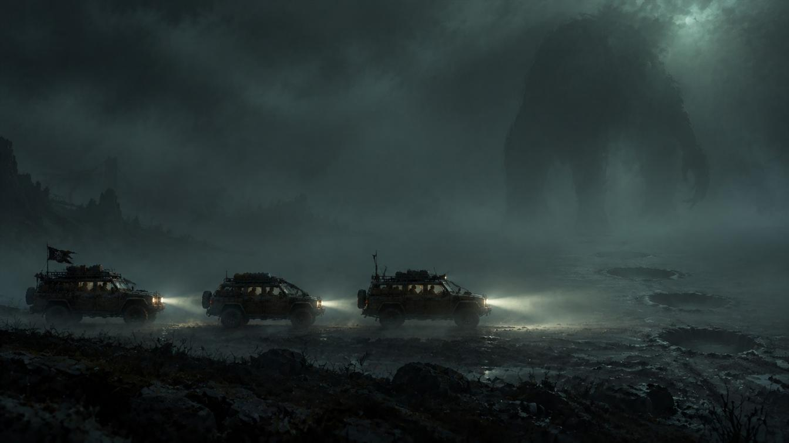

**说明**

画面：夜晚大雾，三辆车沿公路缓慢行驶，车灯只能照出很短一段路；雾中前方是一个巨大到看不清边界的轮廓，以及一排比车辆还大的深陷脚印。没有人下车。

情绪：诡异、克制，没有正面冲突。主色灰绿冷光。

结局说明：他们不再试图消灭它——他们学会按它的规律安排作息、路线与声音。

**图 46　结局 · 文化遗产**

出现时机：触发条件：成员全部死亡，但书籍、地图或符号被其他人发现

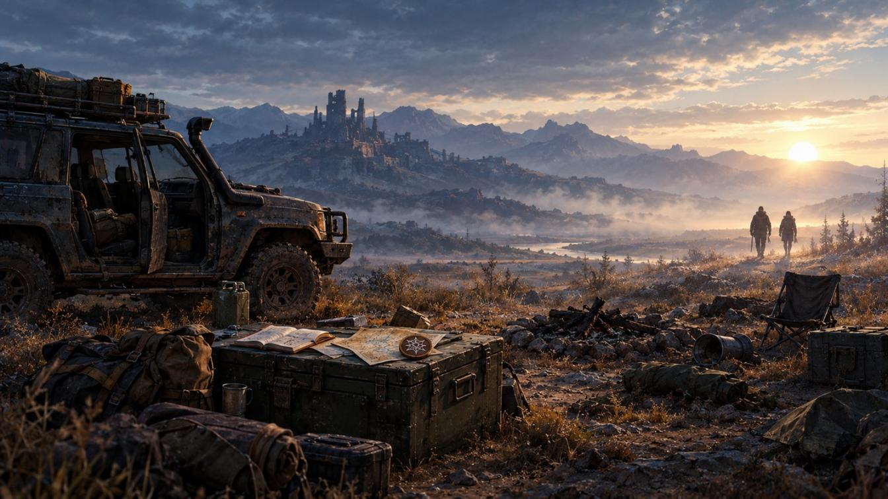

**说明**

画面：清晨，一个被遗弃的营地——熄灭的篝火、几件行囊、一辆车门敞开的越野车；画面中央一只弹药箱上摊开着书籍、手绘地图与一枚符号牌。画面右侧远处，两个后来者正朝这里走来。

情绪：人没了，东西留下了。主色灰蓝与暖米色。

结局说明：车队没有抵达任何地方，但他们画的路标被另一群人捡了起来。

**图 47　结局 · 黑旗车队**

出现时机：触发条件：信任崩溃，车队转变成掠夺或强制统治组织

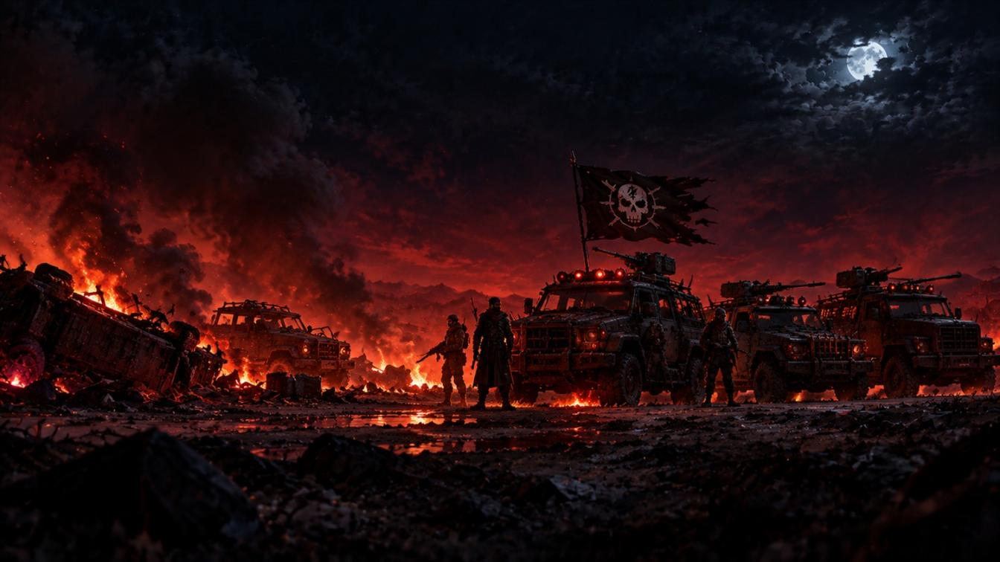

**说明**

画面：夜晚，三辆车加装钢板与武器停在画面右侧；画面左侧是被劫掠过的另一支车队的残骸与翻倒的车。黑色骷髅旗在风中展开，几个人影站在车旁，姿态强硬。

情绪：强硬、冷酷。主色黑红，火光强烈。无人质特写、无血腥。

结局说明：当信任先耗尽，车队就只剩武器和油——他们活着，但变成了别人路上的灾难。

**图 48　结局 · 全员死亡**

出现时机：触发条件：只剩队长后，下一回合仍未补充资源

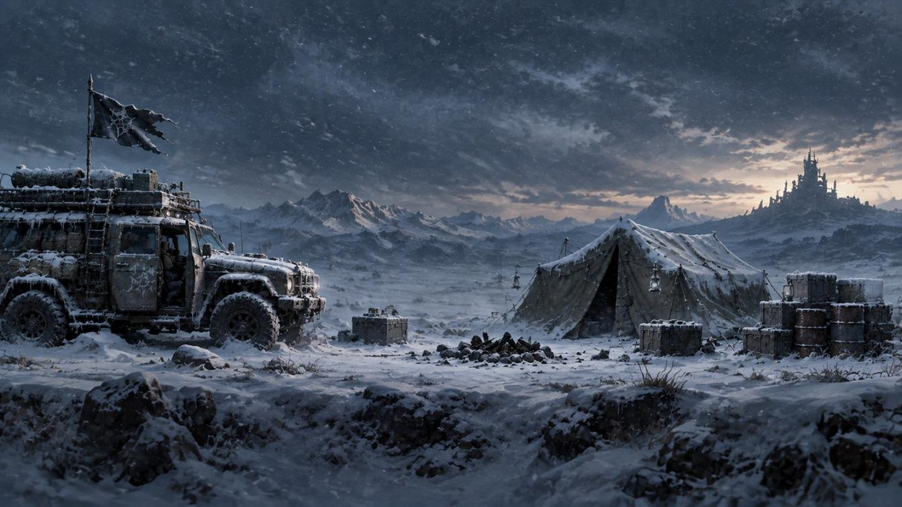

**说明**

画面：风雪黄昏，车辆被积雪半埋，车门半开，车顶物资结着冰，篝火只剩一圈焦黑；画面中没有人，远处是模糊山影与降雪。

情绪：彻底静止。主色冷灰白，无暖光。不出现尸体、不血腥。

结局说明：停歇点的每一次取舍都正确得不够多，最后就没有下一次停歇了。

**图 49　结局 · 无名消失**

出现时机：触发条件：车队死亡，也没有留下可传播的知识或文化

**说明**

画面：沙尘正午，车辆骨架半埋在黄沙里，旗杆上挂着一块已经看不出图案的破布，木箱被沙掩住一半；地上没有任何标记、没有文字、没有墓碑。

情绪：连名字都没留下。主色沙尘暖黄，光线平淡，全图没有人物。

结局说明：这是最安静的一种失败——没有人知道他们曾经往哪个方向走。

**图 50　早晨准备（策划案 4.1 阶段一）**

出现时机：每天开始 → 查看状态并执行一次准备行动

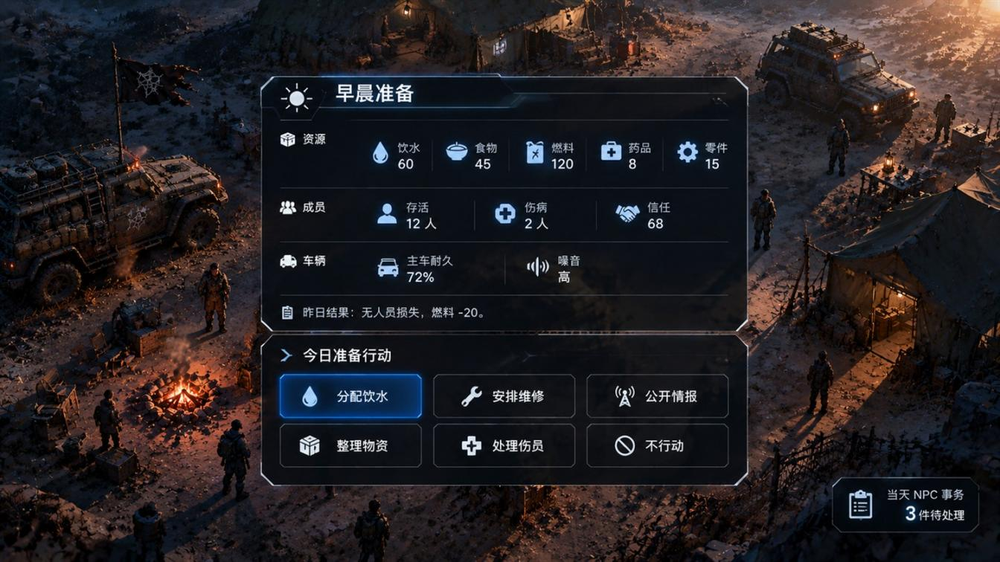

**说明**

画面元素（上帝视角）：清晨停歇点背景；居中「早晨准备」面板——资源行 饮水 60 / 食物 45 / 燃料 120 / 药品 8 / 零件 15；成员行 存活 12 人 / 伤病 2 人 / 信任 68；车辆行 主车耐久 72% / 噪音 高；下方一行昨日结果：无人员损失，燃料 -20。面板下半部为「今日准备行动」六个选项（分配饮水 / 安排维修 / 公开情报 / 整理物资 / 处理伤员 / 不行动），当前「分配饮水」高亮；右下角显示当天 NPC 事务 3 件待处理。

交互说明（安卓触屏）：点按选项执行一次准备行动；点按右下角事务数进入队列。

设计要点：一屏看完「我现在有什么、昨天发生了什么、今天有几件事」，是每天的第一个决策点。

**图 51　路线选择（策划案 4.1 阶段二）**

出现时机：每天 → 选择当天行进路线

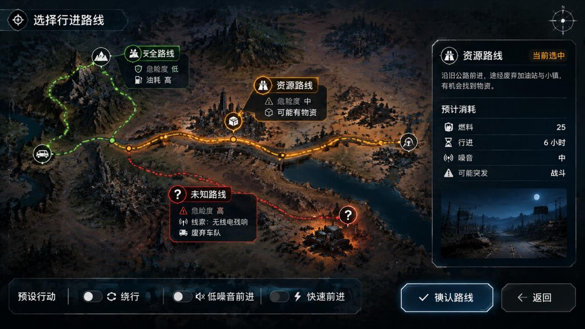

**说明**

画面元素（上帝视角）：手绘质感区域地图，三条路线并列——安全路线（危险度 低 / 油耗 高）、资源路线（危险度 中 / 可能有物资）、未知路线（危险度 高，只显示问号与线索：无线电残响、废弃车队）；当前选中「资源路线」并高亮。右侧信息面板：燃料 25 / 行进 6 小时 / 噪音 中 / 可能突发 战斗。地图下方一行预设行动开关：绕行 / 低噪音前进 / 快速前进。底部：确认路线 / 返回。

交互说明：先选路线，再决定预设行动；预设行动会锁定后续移动阶段的结算方式。

设计要点：未知路线只给线索不给结果，逼玩家在信息不足时下注。

**图 52　移动阶段（策划案 4.1 阶段三）**

出现时机：确认路线后 → 车队自动前进

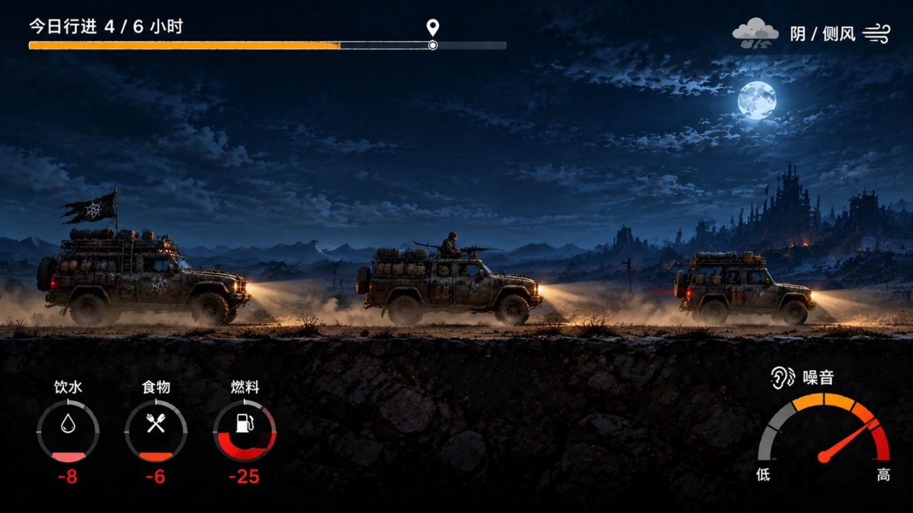

**说明**

画面元素（2D 横版侧视）：三辆车侧向行驶，尘土在侧视剖面地面散开；顶部路线进度条 今日行进 4 / 6 小时；左下角三个消耗仪表 饮水 -8 / 食物 -6 / 燃料 -25（红色为消耗）；右下角噪音表指针位于「高」区；顶部右侧显示天气 阴 / 侧风。

交互说明：本阶段不能打开对话树重新规划；发生突发时只能执行预设行动或一个短促反应。

设计要点：把「正在付出代价」可视化——进度、消耗、噪音三条读数同时可见，噪音高会直接提高突发概率。

**图 53　停歇与对话（策划案 4.1 阶段四）**

出现时机：抵达停歇点 → 处理 NPC 对话队列

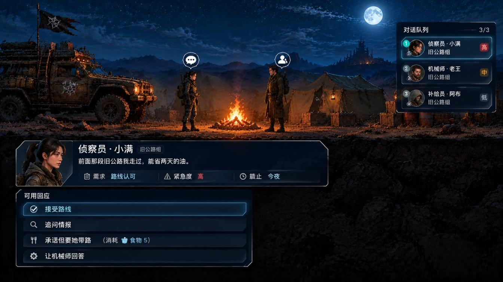

**说明**

画面元素（2D 横版侧视）：黄昏停歇点，队长与成员侧身面对面站在篝火旁。下方对话界面：说话人「侦察员 · 小满」、所属群体「旧公路组」、对白：前面那段旧公路我走过，能省两天的油。对白下显示她的当日事务：需求 路线认可 / 紧急度 高 / 截止 今夜。再下方四条可用回应：接受路线 / 追问情报 / 承诺但要她带路（消耗 食物 5）/ 让机械师回答。画面右侧为「对话队列」，按紧急度排列共 3 件，当前处理第 1 件。

交互说明（安卓触屏）：点按回应即生效；每条回应标出消耗与可能影响。

设计要点：对话是本作主要玩法——回应会写入历史记录，并改变下一天的 NPC 事务。

**图 54　营地行动（策划案 4.1 阶段五）**

出现时机：对话处理完 → 每晚执行一次营地行动

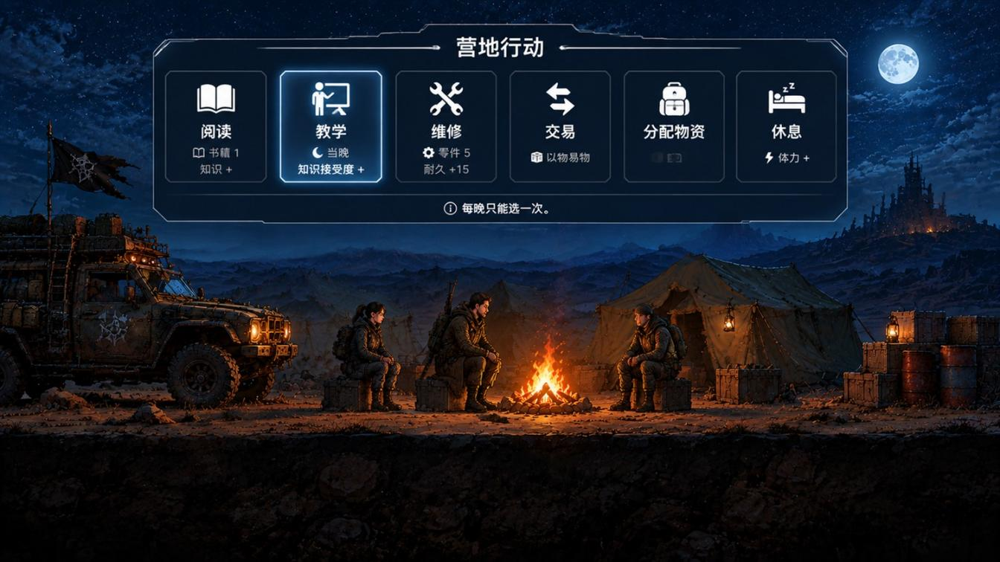

**说明**

画面元素（2D 横版侧视）：夜间停歇点，队长与两名成员围火而坐；上方浮出「营地行动」面板，六个选项各带图标与消耗说明：阅读（书籍 1，知识 +）/ 教学（当晚，知识接受度 +）/ 维修（零件 5，耐久 +15）/ 交易（以物易物）/ 分配物资 / 休息（体力 +）；当前「教学」高亮，底部提示：每晚只能选一次。

交互说明：选定即结算，不提供「全部执行」——时间与资源只够做一件事。

设计要点：营地行动是长期路线的塑造点：选教学走知识路线，选维修走车辆路线，选交易走关系路线。

**图 55　夜间结算（策划案 4.1 阶段六）**

出现时机：营地行动后 → 夜间涌现结算

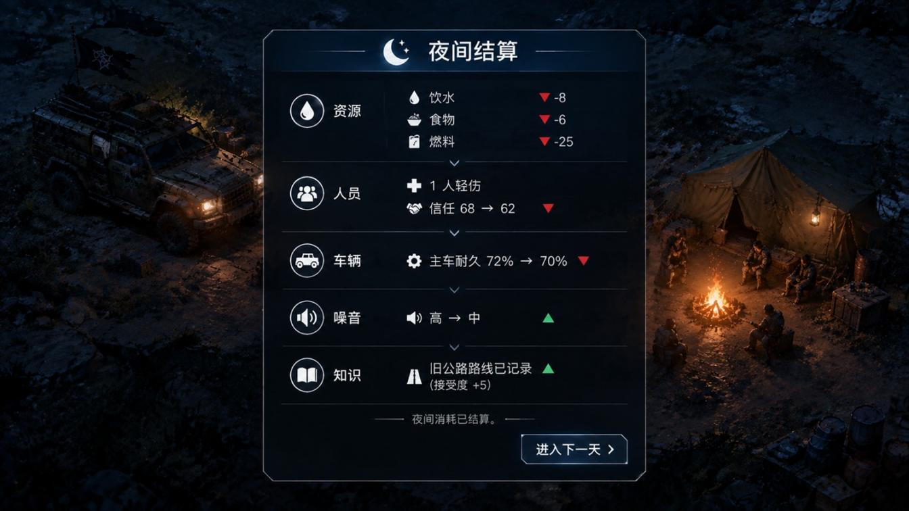

**说明**

画面元素（上帝视角）：压暗的夜间停歇点；中央「夜间结算」面板按因果链逐行显示：资源 饮水 -8 / 食物 -6 / 燃料 -25；人员 1 人轻伤、信任 68 → 62；车辆 主车耐久 72% → 70%；噪音 高 → 中；知识 旧公路路线已记录（接受度 +5）。每行带图标与绿升 / 红降箭头；底部小字：夜间消耗已结算；右下角按钮：进入下一天。

交互说明：本阶段只读，不再追加选择。

设计要点：把当天的因果一次性摊开，让玩家复盘「我那个决定换来了什么」。

**图 56　NPC 当日事务（策划案 4.2）**

出现时机：每天早晨 → 系统为每个存活 NPC 生成事务

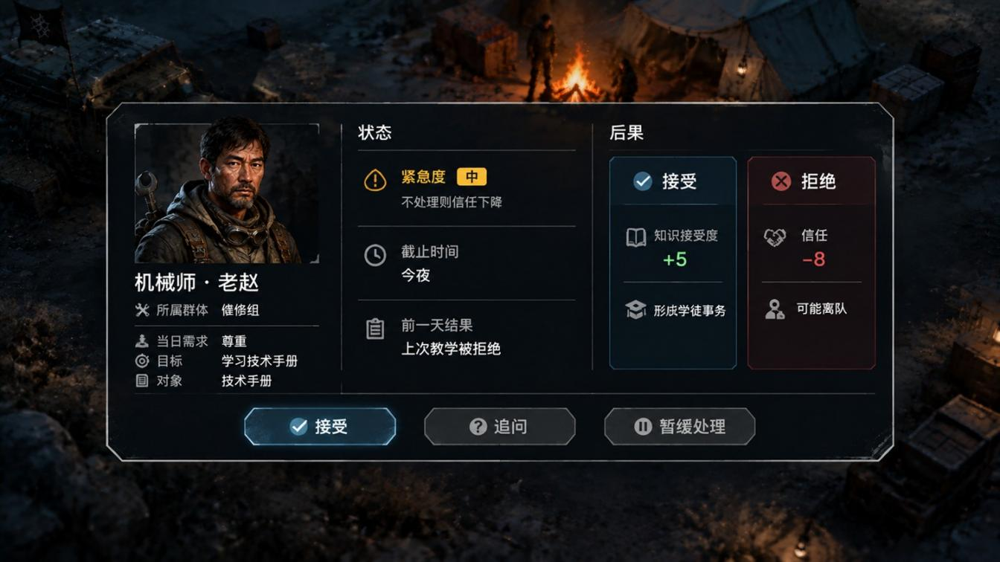

**说明**

画面元素（上帝视角）：清晨停歇点背景（压暗）；居中一张事务卡，三栏式——左栏人物头像与信息：机械师 · 老赵 / 所属群体 维修组 / 需求 尊重 / 目标 学习技术手册 / 对象 技术手册；中栏状态：紧急度 中（不处理则信任下降）/ 截止 今夜 / 前一天结果 上次教学被拒绝；右栏「后果」两列对照：接受 → 知识接受度 +5、形成学徒事务；拒绝 → 信任 -8、可能离队。卡片下方：接受 / 追问 / 暂缓处理。

交互说明：事务由需求、职业、群体、记忆、前一天结果与资源状态共同生成，紧急度决定它是否进入当天队列。

设计要点：卡片必须在决策前就把「接受与拒绝的后果」写清楚——选择才有重量。

**图 57　对话结果与次日因果（策划案 4.2）**

出现时机：回应之后 → 写入历史并影响下一天

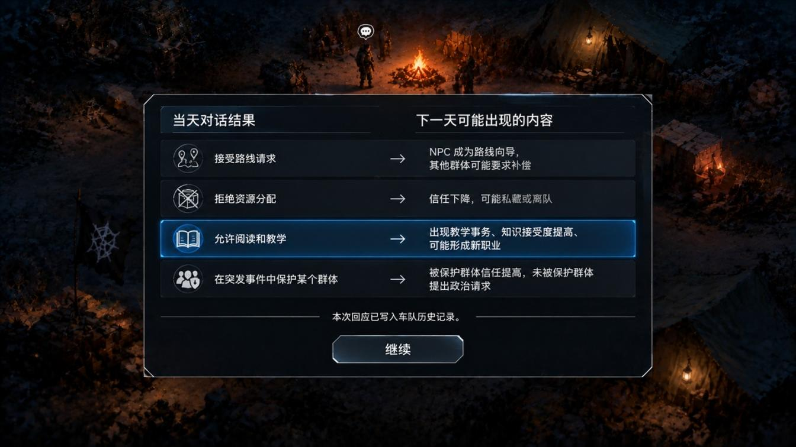

**说明**

画面元素（上帝视角）：夜间停歇点背景（压暗）；中央双栏「因果记录」面板。左栏「当天对话结果」：接受路线请求 / 拒绝资源分配 / 允许阅读和教学 / 在突发事件中保护某个群体，其中「允许阅读和教学」高亮。右栏「下一天可能出现的内容」逐行对应：NPC 成为路线向导，其他群体可能要求补偿 / 信任下降，可能私藏或离队 / 出现教学事务、知识接受度提高、可能形成新职业 / 被保护群体信任提高，未被保护群体提出政治请求。面板底部：本次回应已写入车队历史记录。

交互说明：只读回顾，确认今天的选择如何在明天生效。

设计要点：这一页是「涌现」的说明书——玩家能亲眼看到自己如何把车队推向某个方向。

**图 58　即时突发 · 战斗遭遇（策划案 4.3）**

出现时机：移动阶段随机触发

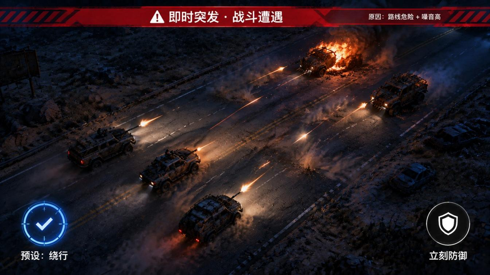

**说明**

画面元素（上帝视角）：斜 45 度俯视的夜间公路战场；我方三辆车与两辆敌方改装车交火，曳光弹斜向穿梭，一辆敌方车已起火冒烟；顶部红色警示条：即时突发 · 战斗遭遇，右侧原因：路线危险 + 噪音高。画面底部只有两个元素：左侧预设行动徽标「预设：绕行」（已启用），右侧短促反应按钮「立刻防御」。

交互说明：突发期间不打开完整对话树与资源面板，只用前一夜留下的预设行动结算，最多给一个短促反应。

设计要点：这是「提前想好」的惩罚机制——移动阶段没有时间重新规划。

**图 59　即时突发 · 怪物群（策划案 4.3）**

出现时机：夜间 / 噪音高 / 气味未处理时触发

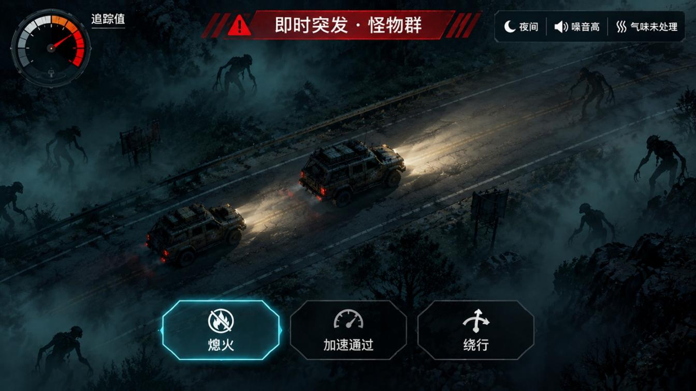

**说明**

画面元素（上帝视角）：斜 45 度俯视的夜间公路；我方两辆车沿公路行驶，两侧雾气中浮出多个异变生物剪影（只有轮廓，不血腥）；顶部红色警示条：即时突发 · 怪物群，右侧条件：夜间 + 噪音高 + 气味未处理。左上角「追踪值」仪表指针接近红区。底部三个预设行动：熄火 / 加速通过 / 绕行，当前「熄火」高亮。

交互说明：结果直接作用于追踪值、路线阻塞与人员损失，不进入对话。

设计要点：怪物不是战斗对象而是压力来源——噪音与气味才是真正的敌人。

**图 60　即时突发 · 道路事故（策划案 4.3）**

出现时机：路面状态与车辆类型不匹配时触发

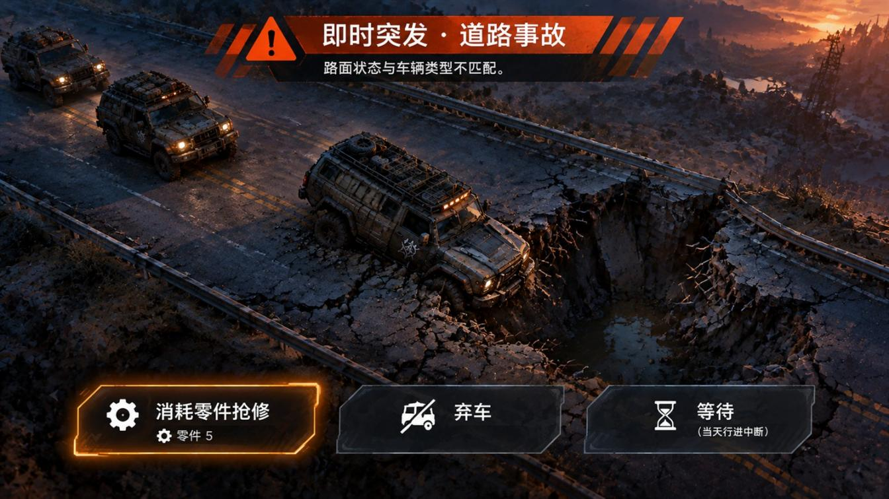

**说明**

画面元素（上帝视角）：斜 45 度俯视的黄昏公路，中央路面塌陷，主车斜停在塌陷边缘、轮胎陷进裂缝，后方两辆车排队停着；俯视角度能看清塌陷的坑洞形状、断裂钢筋与路面裂纹。顶部橙色警示条：即时突发 · 道路事故，说明：路面状态与车辆类型不匹配。底部三个选项：消耗零件抢修（零件 5）/ 弃车 / 等待（当天行进中断），当前「消耗零件抢修」高亮。

交互说明：抢修消耗零件、弃车永久减员车辆、等待则当天行进中断并让下一次停歇多出 NPC 事务。

设计要点：三种代价分别落在资源、车辆与时间上，没有免费的选项。

**图 61　即时突发 · 短促求救信号（策划案 4.3）**

出现时机：无线电模块、路线位置与历史线索满足条件时触发

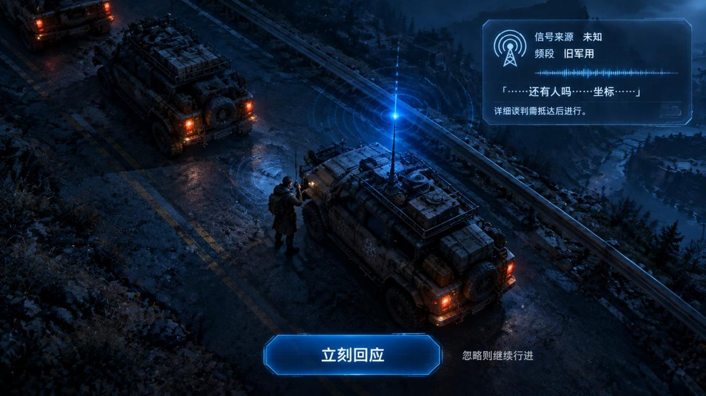

**说明**

画面元素（上帝视角）：斜 45 度俯视的夜间公路，车队停在路边，队长站在主车旁拿着车载电台话筒（只见人物与车顶轮廓），车顶天线亮着信号灯并散出电波纹路。右上角半透明无线电面板：信号来源 未知 / 频段 旧军用 / 断续语音「……还有人吗……坐标……」；下方小字：详细谈判需抵达后进行。底部只有一个按钮：立刻回应，旁边小字：忽略则继续行进。

交互说明：此处只能决定是否立刻回应；详细谈判放到抵达后的 NPC 对话阶段。

设计要点：把「回应求救」压缩成一次按键，随后把后果交给后面的对话系统，节奏不被打断。

**覆盖情况与后续可选项**

已覆盖（60 张；图 18 结算界面已按要求删除）：启动 → 标题 → 主菜单 → 设置（画面 / 音频 / 游戏 / 操作 / 键位重绑定 / 辅助功能 / 应用确认）→ 存档选择 → 序章对话 → 新手教学 → 休息点（自由探索 / 队友对话 / 物资分配 / 队伍与关系）→ 碰面其他车队 → 交易 / 谈判 → 选择结果 → 车队整备 → 技能升级 → 大地图选路 → 赶路 HUD → 偶发遭遇（战斗，结算界面已删除）→ 暂停 → 存读档 → 退出确认。构成完整闭环；另含 6 张可替换休息点场景、13 张结局插画，以及依据策划案 4.1–4.3 制作的 12 张每日流程与突发配图，休息点相关的 8 张为核心玩法。

如需继续扩展，建议按优先级补以下画面：

扩展 01 键位冲突提示弹窗（重绑定时与已有键位冲突）

扩展 02 车队声望 / 派系关系界面（长期选择影响各车队态度）

扩展 03 电台 / 日志界面（剧情回放与任务清单）

扩展 04 成就与统计界面

扩展 05 制作人员名单（Credits）

扩展 06 多人 / 联机大厅（若后续需要）

风格约束：以上扩展沿用本图册的统一规范——夜晚营地背景 + 冷蓝夜色与暖橙火光对冲 + 白色无衬线中文字体 + 半透明深色面板与细白描边；游戏内画面一律使用 HD-2D 斜 45 度俯视伪 3D 视角。
